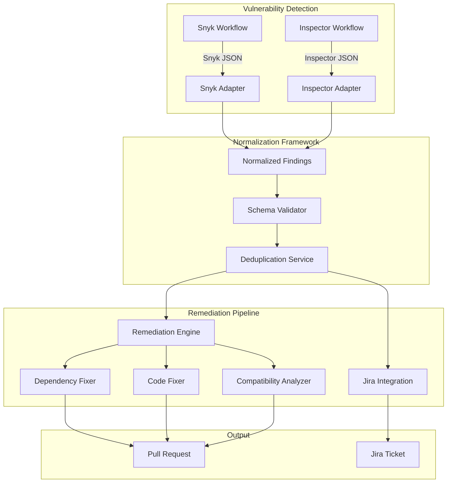
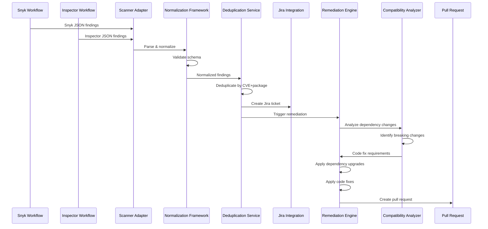
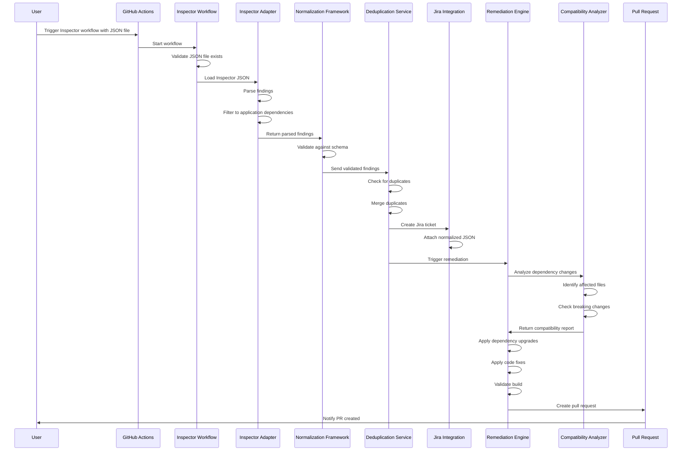
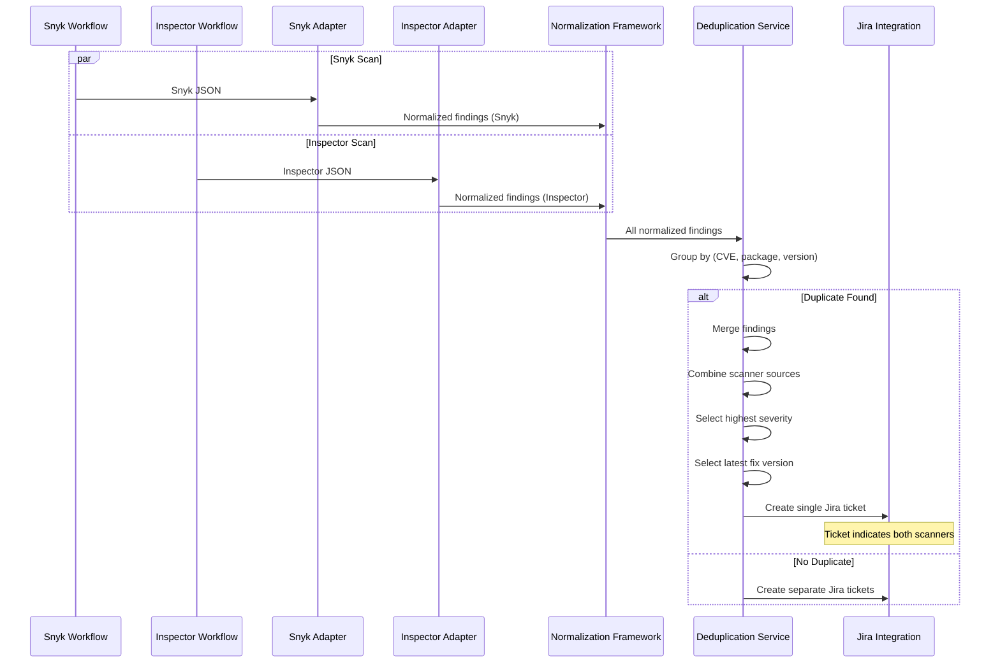
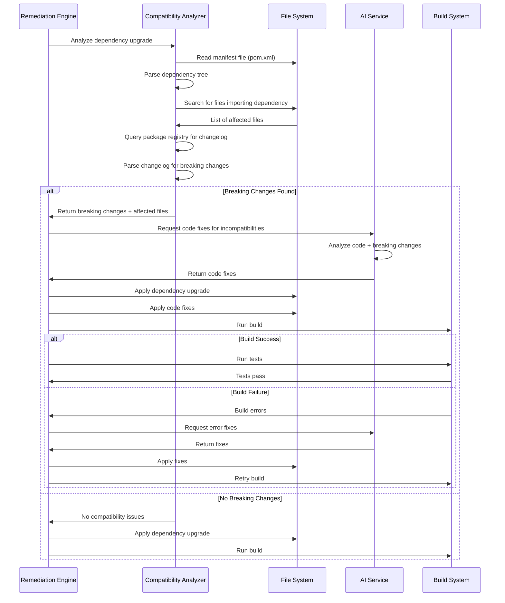

# Design Document: AWS Inspector Integration

## Overview

This design extends the existing GitHub Actions-based autonomous vulnerability remediation pipeline to support AWS Inspector findings alongside Snyk. The system currently processes Snyk scan results through normalization, Jira ticket creation, and automated remediation workflows. This integration introduces a generic normalization framework with pluggable scanner adapters, enabling multiple vulnerability scanners to be supported without duplicating remediation logic.

### Key Design Goals

1. **Scanner-Agnostic Architecture**: Refactor the existing Snyk-specific normalization logic into a pluggable adapter pattern that supports multiple vulnerability scanners
2. **Backward Compatibility**: Maintain 100% compatibility with the existing Snyk workflow without requiring changes to triggers, secrets, or outputs
3. **Application Dependency Focus**: Filter AWS Inspector findings to include only application-level dependencies (npm, Maven, Gradle, pip) and exclude OS-level packages
4. **Deduplication**: Identify and merge duplicate vulnerabilities reported by multiple scanners
5. **Extensibility**: Design the framework to easily accommodate future scanners (Trivy, Dependabot, Prisma, Wiz, Qualys)
6. **Dependency-Code Compatibility**: Analyze and fix code compatibility issues when upgrading dependencies

### Design Principles

- **Separation of Concerns**: Scanner-specific parsing logic is isolated in adapter modules; remediation logic operates only on normalized data
- **Single Responsibility**: Each component has one clear purpose (parsing, normalization, deduplication, remediation)
- **Open/Closed Principle**: The framework is open for extension (new adapters) but closed for modification (core logic unchanged)
- **Fail-Safe Defaults**: Invalid or unrecognized findings are logged and excluded rather than causing pipeline failures

## Architecture

### High-Level System Architecture



### Component Interaction Flow



### Architecture Decision Records

**ADR-001: Pluggable Adapter Pattern**
- **Decision**: Use the adapter pattern for scanner-specific parsing logic
- **Rationale**: Isolates scanner-specific code, enables independent testing, and allows new scanners to be added without modifying core framework
- **Consequences**: Each scanner requires a dedicated adapter module, but remediation logic remains scanner-agnostic

**ADR-002: Application Dependency Filtering**
- **Decision**: Filter Inspector findings to application dependencies only (npm, Maven, Gradle, pip)
- **Rationale**: OS-level vulnerabilities require different remediation strategies (infrastructure updates, container base image changes) that are outside the scope of application code remediation
- **Consequences**: Some Inspector findings will be excluded; separate workflows may be needed for infrastructure vulnerabilities

**ADR-003: CVE-Based Deduplication**
- **Decision**: Use CVE + package name + version as the deduplication key
- **Rationale**: CVE is the most reliable cross-scanner identifier for the same vulnerability
- **Consequences**: Vulnerabilities without CVEs may not be deduplicated; scanner-specific IDs are preserved in metadata

**ADR-004: Backward Compatibility Requirement**
- **Decision**: Existing Snyk workflow must produce identical outputs after refactoring
- **Rationale**: Minimize risk and deployment complexity; allow gradual rollout
- **Consequences**: Refactoring must be done carefully with comprehensive testing

**ADR-005: Dependency-Code Compatibility Analysis**
- **Decision**: Analyze code for breaking changes when upgrading dependencies
- **Rationale**: Dependency upgrades often introduce breaking API changes that cause build failures
- **Consequences**: Requires additional AI analysis step and code modification logic

## Components and Interfaces

### 1. Normalization Framework Core

**Purpose**: Provides the common infrastructure for scanner adapters and normalized finding validation.

**Responsibilities**:
- Define the normalized vulnerability schema
- Validate normalized findings against the schema
- Register and manage scanner adapters
- Coordinate the normalization process

**Interface**:

```python
class NormalizationFramework:
    """
    Core framework for scanner-agnostic vulnerability normalization.
    
    Design: This class implements the registry pattern, allowing scanner
    adapters to be registered dynamically without modifying core code.
    """
    
    def __init__(self):
        self._adapters: Dict[str, ScannerAdapter] = {}
        self._schema = self._load_schema()
    
    def register_adapter(self, scanner_name: str, adapter: ScannerAdapter) -> None:
        """
        Register a scanner adapter with the framework.
        
        Args:
            scanner_name: Unique identifier for the scanner (e.g., "snyk", "inspector")
            adapter: Instance of a ScannerAdapter implementation
        
        Raises:
            ValueError: If adapter does not implement required interface
        """
        if not isinstance(adapter, ScannerAdapter):
            raise ValueError(f"Adapter must implement ScannerAdapter interface")
        self._adapters[scanner_name] = adapter
    
    def normalize(self, scanner_name: str, raw_findings: dict) -> List[NormalizedFinding]:
        """
        Normalize findings from a specific scanner.
        
        Args:
            scanner_name: Name of the scanner that produced the findings
            raw_findings: Scanner-specific JSON output
        
        Returns:
            List of validated normalized findings
        
        Raises:
            ValueError: If scanner_name is not registered
            ValidationError: If normalized findings fail schema validation
        """
        adapter = self._adapters.get(scanner_name)
        if not adapter:
            raise ValueError(f"No adapter registered for scanner: {scanner_name}")
        
        normalized = adapter.parse(raw_findings)
        validated = [f for f in normalized if self._validate(f)]
        
        invalid_count = len(normalized) - len(validated)
        if invalid_count > 0:
            logger.warning(f"Excluded {invalid_count} invalid findings from {scanner_name}")
        
        return validated
    
    def _validate(self, finding: NormalizedFinding) -> bool:
        """
        Validate a normalized finding against the schema.
        
        Returns:
            True if valid, False otherwise (logs validation errors)
        """
        try:
            jsonschema.validate(instance=finding.to_dict(), schema=self._schema)
            return True
        except jsonschema.ValidationError as e:
            logger.error(f"Validation failed for finding {finding.id}: {e.message}")
            return False
```

### 2. Scanner Adapter Interface

**Purpose**: Defines the contract that all scanner adapters must implement.

**Interface**:

```python
from abc import ABC, abstractmethod
from typing import List, Dict

class ScannerAdapter(ABC):
    """
    Abstract base class for scanner adapters.
    
    Design: This interface ensures all adapters provide consistent parsing
    behavior while allowing scanner-specific implementation details.
    """
    
    @abstractmethod
    def parse(self, raw_findings: dict) -> List[NormalizedFinding]:
        """
        Parse scanner-specific findings into normalized format.
        
        Args:
            raw_findings: Scanner-specific JSON output
        
        Returns:
            List of normalized findings (may include invalid findings)
        
        Implementation notes:
        - Extract all required fields from scanner-specific format
        - Map scanner severity levels to normalized levels
        - Preserve scanner-specific metadata in the metadata field
        - Return all findings; validation happens in the framework
        """
        pass
    
    @abstractmethod
    def get_scanner_name(self) -> str:
        """Return the unique identifier for this scanner."""
        pass
    
    @abstractmethod
    def get_scanner_version(self) -> str:
        """Return the scanner version (for audit trail)."""
        pass
```

### 3. Snyk Scanner Adapter

**Purpose**: Parse Snyk JSON output into normalized findings.

**Implementation Strategy**:
- Refactor existing `normalize.py` logic into the adapter pattern
- Preserve all existing Snyk-specific parsing logic
- Maintain backward compatibility with current Snyk workflow outputs

**Key Methods**:

```python
class SnykAdapter(ScannerAdapter):
    """
    Adapter for Snyk vulnerability scanner.
    
    Design: This adapter encapsulates all Snyk-specific parsing logic,
    including the existing version extraction and vulnerability mapping
    from the current normalize.py script.
    """
    
    def parse(self, raw_findings: dict) -> List[NormalizedFinding]:
        """
        Parse Snyk JSON output.
        
        Snyk format:
        - Dependency vulnerabilities: raw_findings["vulnerabilities"]
        - Code vulnerabilities: raw_findings["runs"][0]["results"]
        """
        findings = []
        findings.extend(self._parse_dependency_vulns(raw_findings))
        findings.extend(self._parse_code_vulns(raw_findings))
        return findings
    
    def _parse_dependency_vulns(self, data: dict) -> List[NormalizedFinding]:
        """
        Parse Snyk dependency vulnerabilities.
        
        Preserves existing logic from normalize.py:parse_dependency_scan()
        """
        # Implementation: existing parse_dependency_scan logic
        pass
    
    def _parse_code_vulns(self, data: dict) -> List[NormalizedFinding]:
        """
        Parse Snyk code vulnerabilities.
        
        Preserves existing logic from normalize.py:parse_code_scan()
        """
        # Implementation: existing parse_code_scan logic
        pass
```

### 4. AWS Inspector Scanner Adapter

**Purpose**: Parse AWS Inspector JSON output into normalized findings, filtering to application dependencies only.

**Implementation Strategy**:
- Parse Inspector JSON format (findings array structure)
- Apply application dependency filtering (npm, Maven, Gradle, pip only)
- Extract CVE, severity, and fix version information
- Map Inspector severity levels to normalized levels

**Key Methods**:

```python
class InspectorAdapter(ScannerAdapter):
    """
    Adapter for AWS Inspector vulnerability scanner.
    
    Design: This adapter implements application dependency filtering as a
    core responsibility, excluding OS-level packages before normalization.
    
    Filtering rationale: OS-level vulnerabilities (apt, yum, apk, rpm) require
    infrastructure remediation (base image updates, OS patches) rather than
    application code changes. This adapter focuses exclusively on application
    dependencies that can be fixed via package manager updates.
    """
    
    # Application package managers we support
    APP_PACKAGE_MANAGERS = {"npm", "maven", "gradle", "pip", "pypi"}
    
    # OS package managers we exclude
    OS_PACKAGE_MANAGERS = {"apt", "yum", "apk", "rpm", "dpkg"}
    
    def parse(self, raw_findings: dict) -> List[NormalizedFinding]:
        """
        Parse AWS Inspector JSON output.
        
        Inspector format:
        - Findings: raw_findings["findings"]
        - Each finding contains: packageVulnerabilityDetails, severity, etc.
        """
        findings = []
        for raw_finding in raw_findings.get("findings", []):
            if self._is_application_dependency(raw_finding):
                normalized = self._normalize_finding(raw_finding)
                if normalized:
                    findings.append(normalized)
        return findings
    
    def _is_application_dependency(self, finding: dict) -> bool:
        """
        Filter to application dependencies only.
        
        Returns True if the finding targets an application dependency
        (npm, Maven, Gradle, pip), False for OS packages or infrastructure.
        
        Filtering logic:
        1. Check packageVulnerabilityDetails.sourcePackageName for package manager prefix
        2. Check packageVulnerabilityDetails.vulnerablePackages[].packageManager
        3. Exclude if source is "OS" or "OPERATING_SYSTEM"
        """
        pkg_details = finding.get("packageVulnerabilityDetails", {})
        
        # Check package manager field
        for vuln_pkg in pkg_details.get("vulnerablePackages", []):
            pkg_mgr = vuln_pkg.get("packageManager", "").lower()
            if pkg_mgr in self.APP_PACKAGE_MANAGERS:
                return True
            if pkg_mgr in self.OS_PACKAGE_MANAGERS:
                return False
        
        # Check source field
        source = pkg_details.get("source", "").upper()
        if source in ("OS", "OPERATING_SYSTEM", "SYSTEM"):
            return False
        
        # Default: exclude if uncertain (fail-safe)
        return False
    
    def _normalize_finding(self, finding: dict) -> Optional[NormalizedFinding]:
        """
        Convert Inspector finding to normalized format.
        
        Maps Inspector fields:
        - findingArn -> id
        - severity -> severity (map CRITICAL/HIGH/MEDIUM/LOW)
        - packageVulnerabilityDetails.vulnerablePackages -> package info
        - packageVulnerabilityDetails.relatedVulnerabilities -> CVE list
        - remediation.recommendation.text -> fixed_version extraction
        """
        pkg_details = finding.get("packageVulnerabilityDetails", {})
        vuln_packages = pkg_details.get("vulnerablePackages", [])
        
        if not vuln_packages:
            return None
        
        # Use first vulnerable package (Inspector may list multiple)
        vuln_pkg = vuln_packages[0]
        
        return NormalizedFinding(
            id=finding.get("findingArn", str(uuid.uuid4())),
            scanner="inspector",
            package_manager=vuln_pkg.get("packageManager", "unknown"),
            package_name=vuln_pkg.get("name", "unknown"),
            current_version=vuln_pkg.get("version", "unknown"),
            fixed_version=self._extract_fixed_version(finding),
            severity=self._map_severity(finding.get("severity", "MEDIUM")),
            cve=self._extract_cves(pkg_details),
            manifest_file=vuln_pkg.get("filePath", "unknown"),
            remediation_type=self._determine_remediation_type(finding),
            repository=finding.get("resources", [{}])[0].get("id", "unknown"),
            metadata={
                "inspector_finding_arn": finding.get("findingArn"),
                "inspector_title": finding.get("title"),
                "inspector_description": finding.get("description"),
                "inspector_first_observed": finding.get("firstObservedAt"),
                "inspector_last_observed": finding.get("lastObservedAt"),
            }
        )
    
    def _extract_fixed_version(self, finding: dict) -> str:
        """
        Extract fixed version from Inspector remediation recommendation.
        
        Inspector provides fix information in:
        - remediation.recommendation.text (e.g., "Upgrade to version 2.3.1")
        - packageVulnerabilityDetails.vulnerablePackages[].fixedInVersion
        """
        # Strategy 1: Check fixedInVersion field
        pkg_details = finding.get("packageVulnerabilityDetails", {})
        for vuln_pkg in pkg_details.get("vulnerablePackages", []):
            fixed = vuln_pkg.get("fixedInVersion")
            if fixed:
                return fixed
        
        # Strategy 2: Parse remediation text
        remediation = finding.get("remediation", {}).get("recommendation", {}).get("text", "")
        version_match = re.search(r"version\s+([0-9]+\.[0-9]+\.[0-9]+)", remediation, re.IGNORECASE)
        if version_match:
            return version_match.group(1)
        
        return "unknown"
    
    def _extract_cves(self, pkg_details: dict) -> List[str]:
        """Extract CVE identifiers from related vulnerabilities."""
        cves = []
        for vuln in pkg_details.get("relatedVulnerabilities", []):
            cve_id = vuln.get("id")
            if cve_id and cve_id.startswith("CVE-"):
                cves.append(cve_id)
        return cves
    
    def _map_severity(self, inspector_severity: str) -> str:
        """
        Map Inspector severity to normalized severity.
        
        Inspector levels: CRITICAL, HIGH, MEDIUM, LOW, INFORMATIONAL
        Normalized levels: critical, high, medium, low
        """
        mapping = {
            "CRITICAL": "critical",
            "HIGH": "high",
            "MEDIUM": "medium",
            "LOW": "low",
            "INFORMATIONAL": "low",
            "UNTRIAGED": "medium",
        }
        return mapping.get(inspector_severity.upper(), "medium")
    
    def _determine_remediation_type(self, finding: dict) -> str:
        """
        Determine remediation type (dependency or code).
        
        Inspector findings are primarily dependency vulnerabilities.
        Code vulnerabilities would come from Inspector code scanning (if enabled).
        """
        finding_type = finding.get("type", "")
        if "PACKAGE_VULNERABILITY" in finding_type:
            return "dependency"
        elif "CODE_VULNERABILITY" in finding_type:
            return "code"
        return "dependency"  # Default for Inspector
```

### 5. Deduplication Service

**Purpose**: Identify and merge duplicate vulnerabilities from multiple scanners.

**Deduplication Strategy**:
- Primary key: CVE + package name + current version + repository
- Merge strategy: Preserve all scanner sources, select highest severity, select most recent fixed version

**Implementation**:

```python
class DeduplicationService:
    """
    Identifies and merges duplicate vulnerability findings from multiple scanners.
    
    Design: Uses CVE as the primary deduplication key because it is the most
    reliable cross-scanner identifier. Scanner-specific IDs are preserved in
    metadata for audit trail.
    
    Deduplication rationale: Multiple scanners may report the same vulnerability
    with different IDs but the same CVE. Merging prevents duplicate remediation
    work and duplicate Jira tickets.
    """
    
    def deduplicate(self, findings: List[NormalizedFinding]) -> List[NormalizedFinding]:
        """
        Deduplicate findings across scanners.
        
        Args:
            findings: List of normalized findings from all scanners
        
        Returns:
            Deduplicated list with merged metadata
        
        Algorithm:
        1. Group findings by (CVE, package_name, current_version, repository)
        2. For each group with multiple findings:
           - Merge scanner sources
           - Select highest severity
           - Select most recent fixed version
           - Preserve all scanner-specific metadata
        """
        groups = self._group_by_key(findings)
        deduplicated = []
        
        for key, group in groups.items():
            if len(group) == 1:
                deduplicated.append(group[0])
            else:
                merged = self._merge_findings(group)
                deduplicated.append(merged)
        
        return deduplicated
    
    def _group_by_key(self, findings: List[NormalizedFinding]) -> Dict[tuple, List[NormalizedFinding]]:
        """Group findings by deduplication key."""
        groups = defaultdict(list)
        for finding in findings:
            # Use first CVE if multiple exist
            cve = finding.cve[0] if finding.cve else "NO_CVE"
            key = (cve, finding.package_name, finding.current_version, finding.repository)
            groups[key].append(finding)
        return groups
    
    def _merge_findings(self, findings: List[NormalizedFinding]) -> NormalizedFinding:
        """
        Merge multiple findings into one.
        
        Merge strategy:
        - ID: Use first finding's ID
        - Scanner: Combine all scanner names (e.g., "snyk,inspector")
        - Severity: Select highest (critical > high > medium > low)
        - Fixed version: Select most recent version
        - CVE: Union of all CVEs
        - Metadata: Merge all scanner-specific metadata
        """
        base = findings[0]
        
        # Combine scanner names
        scanners = ",".join(sorted(set(f.scanner for f in findings)))
        
        # Select highest severity
        severity_order = {"critical": 4, "high": 3, "medium": 2, "low": 1}
        highest_severity = max(findings, key=lambda f: severity_order.get(f.severity, 0)).severity
        
        # Select most recent fixed version
        fixed_versions = [f.fixed_version for f in findings if f.fixed_version != "unknown"]
        if fixed_versions:
            # Use packaging.version for proper version comparison
            latest_fixed = max(fixed_versions, key=lambda v: version.parse(v))
        else:
            latest_fixed = "unknown"
        
        # Union of CVEs
        all_cves = list(set(cve for f in findings for cve in f.cve))
        
        # Merge metadata
        merged_metadata = {}
        for f in findings:
            merged_metadata.update(f.metadata)
        merged_metadata["deduplicated_from"] = [f.id for f in findings]
        merged_metadata["source_scanners"] = [f.scanner for f in findings]
        
        return NormalizedFinding(
            id=base.id,
            scanner=scanners,
            package_manager=base.package_manager,
            package_name=base.package_name,
            current_version=base.current_version,
            fixed_version=latest_fixed,
            severity=highest_severity,
            cve=all_cves,
            manifest_file=base.manifest_file,
            remediation_type=base.remediation_type,
            repository=base.repository,
            metadata=merged_metadata
        )
```

### 6. Compatibility Analyzer

**Purpose**: Analyze dependency upgrades for breaking changes and generate code fixes.

**Implementation**:

```python
class CompatibilityAnalyzer:
    """
    Analyzes dependency upgrades for breaking changes and generates code fixes.
    
    Design: This component bridges the gap between dependency upgrades and
    code compatibility. It identifies files that use upgraded dependencies
    and checks for breaking API changes.
    
    Rationale: Dependency upgrades often introduce breaking changes (removed
    methods, changed signatures, renamed classes). Without code fixes, the
    build will fail after dependency upgrades.
    """
    
    def analyze(self, dependency_changes: List[DependencyChange], codebase_path: str) -> List[CodeFix]:
        """
        Analyze dependency changes for code compatibility issues.
        
        Args:
            dependency_changes: List of planned dependency upgrades
            codebase_path: Path to source code directory
        
        Returns:
            List of required code fixes
        
        Algorithm:
        1. For each dependency change, identify affected code files
        2. Check for breaking changes between versions
        3. Generate code fixes for incompatibilities
        """
        code_fixes = []
        
        for change in dependency_changes:
            affected_files = self._find_affected_files(change, codebase_path)
            breaking_changes = self._check_breaking_changes(change)
            
            if breaking_changes:
                for file_path in affected_files:
                    fixes = self._generate_fixes(file_path, breaking_changes)
                    code_fixes.extend(fixes)
        
        return code_fixes
    
    def _find_affected_files(self, change: DependencyChange, codebase_path: str) -> List[str]:
        """
        Find code files that import or use the dependency being upgraded.
        
        Strategy:
        - Search for import statements matching the dependency package
        - For Java: search for import statements with groupId.artifactId
        - For Python: search for import statements with package name
        - For JavaScript: search for require() or import statements
        """
        affected = []
        package_pattern = self._get_import_pattern(change)
        
        for root, _, files in os.walk(codebase_path):
            for file in files:
                if self._is_source_file(file):
                    file_path = os.path.join(root, file)
                    if self._file_imports_package(file_path, package_pattern):
                        affected.append(file_path)
        
        return affected
    
    def _check_breaking_changes(self, change: DependencyChange) -> List[BreakingChange]:
        """
        Check for breaking changes between current and fixed version.
        
        Strategy:
        - Query Maven Central / npm registry for changelog
        - Parse CHANGELOG.md or release notes
        - Look for keywords: "breaking", "removed", "deprecated", "renamed"
        - Use AI to analyze changelog for breaking changes
        """
        # Implementation: query package registry, parse changelog
        pass
    
    def _generate_fixes(self, file_path: str, breaking_changes: List[BreakingChange]) -> List[CodeFix]:
        """
        Generate code fixes for breaking changes.
        
        Strategy:
        - Read source file
        - For each breaking change, identify affected code
        - Generate fix using AI (similar to fix_code_vulnerabilities.py)
        - Return CodeFix objects with file path and fix content
        """
        # Implementation: AI-based code fix generation
        pass
```

## Data Models

### Normalized Vulnerability Schema

```python
from dataclasses import dataclass, field
from typing import List, Dict, Optional
from datetime import datetime

@dataclass
class NormalizedFinding:
    """
    Normalized vulnerability finding schema.
    
    This schema is the single source of truth for vulnerability data across
    all scanners. All scanner-specific fields are mapped to these common fields.
    
    Design: Uses dataclass for immutability and type safety. The metadata field
    provides extensibility for scanner-specific data without modifying the schema.
    """
    
    # Core identification
    id: str  # Unique identifier (scanner-specific ID or generated UUID)
    scanner: str  # Source scanner name (e.g., "snyk", "inspector", "snyk,inspector" for merged)
    
    # Package information
    package_manager: str  # Package manager (npm, maven, gradle, pip, etc.)
    package_name: str  # Package name (e.g., "org.springframework.boot:spring-boot-starter-web")
    current_version: str  # Currently installed version
    fixed_version: str  # Version that fixes the vulnerability (or "unknown")
    
    # Vulnerability details
    severity: str  # Normalized severity: critical, high, medium, low
    cve: List[str]  # List of CVE identifiers
    
    # Remediation information
    manifest_file: str  # Path to manifest file (pom.xml, package.json, requirements.txt)
    remediation_type: str  # Type of remediation: "dependency" or "code"
    
    # Context
    repository: str  # Repository identifier
    branch: str = "main"  # Branch name
    commit_id: str = "unknown"  # Commit SHA
    scan_time: str = field(default_factory=lambda: datetime.utcnow().isoformat())
    
    # Extensibility
    metadata: Dict[str, any] = field(default_factory=dict)  # Scanner-specific metadata
    
    def to_dict(self) -> dict:
        """Convert to dictionary for JSON serialization."""
        return {
            "id": self.id,
            "scanner": self.scanner,
            "package_manager": self.package_manager,
            "package_name": self.package_name,
            "current_version": self.current_version,
            "fixed_version": self.fixed_version,
            "severity": self.severity,
            "cve": self.cve,
            "manifest_file": self.manifest_file,
            "remediation_type": self.remediation_type,
            "repository": self.repository,
            "branch": self.branch,
            "commit_id": self.commit_id,
            "scan_time": self.scan_time,
            "metadata": self.metadata
        }

@dataclass
class DependencyChange:
    """Represents a planned dependency upgrade."""
    package_name: str
    current_version: str
    target_version: str
    package_manager: str

@dataclass
class BreakingChange:
    """Represents a breaking change in a dependency upgrade."""
    change_type: str  # "removed", "renamed", "signature_changed", etc.
    affected_api: str  # Method/class/function name
    description: str
    migration_guide: Optional[str] = None

@dataclass
class CodeFix:
    """Represents a code fix for dependency compatibility."""
    file_path: str
    original_code: str
    fixed_code: str
    reason: str
```

### JSON Schema for Validation

```json
{
  "$schema": "http://json-schema.org/draft-07/schema#",
  "title": "NormalizedFinding",
  "type": "object",
  "required": [
    "id",
    "scanner",
    "package_manager",
    "package_name",
    "current_version",
    "fixed_version",
    "severity",
    "cve",
    "manifest_file",
    "remediation_type",
    "repository"
  ],
  "properties": {
    "id": {
      "type": "string",
      "description": "Unique identifier for the finding"
    },
    "scanner": {
      "type": "string",
      "description": "Source scanner name or comma-separated list for merged findings"
    },
    "package_manager": {
      "type": "string",
      "enum": ["npm", "maven", "gradle", "pip", "pypi", "unknown"]
    },
    "package_name": {
      "type": "string",
      "description": "Package name in package-manager-specific format"
    },
    "current_version": {
      "type": "string",
      "description": "Currently installed version"
    },
    "fixed_version": {
      "type": "string",
      "description": "Version that fixes the vulnerability"
    },
    "severity": {
      "type": "string",
      "enum": ["critical", "high", "medium", "low"]
    },
    "cve": {
      "type": "array",
      "items": {
        "type": "string",
        "pattern": "^CVE-[0-9]{4}-[0-9]+$"
      },
      "description": "List of CVE identifiers"
    },
    "manifest_file": {
      "type": "string",
      "description": "Path to manifest file"
    },
    "remediation_type": {
      "type": "string",
      "enum": ["dependency", "code"]
    },
    "repository": {
      "type": "string",
      "description": "Repository identifier"
    },
    "branch": {
      "type": "string",
      "default": "main"
    },
    "commit_id": {
      "type": "string",
      "default": "unknown"
    },
    "scan_time": {
      "type": "string",
      "format": "date-time"
    },
    "metadata": {
      "type": "object",
      "description": "Scanner-specific metadata"
    }
  }
}
```

## Correctness Properties

*A property is a characteristic or behavior that should hold true across all valid executions of a system—essentially, a formal statement about what the system should do. Properties serve as the bridge between human-readable specifications and machine-verifiable correctness guarantees.*

Before writing correctness properties, I need to analyze the acceptance criteria for testability using the prework tool.


### Property Reflection

After analyzing all acceptance criteria, I identified the following redundancies and consolidations:

**Redundancy Group 1: Schema Validation**
- Properties 2.4, 3.2, 4.2 all test that adapter output validates against the schema
- **Consolidation**: Merge into single property: "For any scanner adapter output, all findings validate against the normalized schema"

**Redundancy Group 2: Backward Compatibility**
- Properties 2.5, 3.3, 9.2, 9.3 all test that refactored code produces identical outputs
- **Consolidation**: Merge into single property: "For any Snyk input, refactored system produces identical output to original implementation"

**Redundancy Group 3: Filtering Logic**
- Properties 5.1, 5.5 both test that application dependencies are included
- Properties 5.2, 5.6 both test that OS packages are excluded
- **Consolidation**: Merge into two properties covering positive and negative filtering cases

**Redundancy Group 4: Remediation Routing**
- Properties 6.4 and 6.5 test remediation type routing
- **Consolidation**: Merge into single property: "For any finding, remediation action is determined by remediation_type field"

**Redundancy Group 5: Jira Integration**
- Properties 7.3, 7.4, 7.5 all test Jira ticket content
- **Consolidation**: Merge into single property: "For any normalized finding, Jira ticket contains all required metadata"

**Redundancy Group 6: Deduplication Merge Behavior**
- Properties 8.3, 8.4, 8.5 all test merge behavior
- **Consolidation**: Merge into single property: "For any set of duplicate findings, merged finding preserves all sources, selects highest severity, and selects most recent fix version"

**Redundancy Group 7: Compatibility Analysis**
- Properties 16.1, 16.2, 16.3 all test pre-upgrade analysis steps
- **Consolidation**: Merge into single property: "For any dependency upgrade, compatibility analysis identifies affected files and breaking changes"

**Redundancy Group 8: Build Validation**
- Properties 16.6, 16.7, 16.8 all test post-remediation validation
- **Consolidation**: Merge into single property: "For any remediation, build and tests are validated, with error recovery on failure"

After consolidation, we have **25 unique properties** that provide comprehensive coverage without redundancy.

### Property-Based Testing Applicability Assessment

This feature is **highly suitable for property-based testing** because:

1. **Pure Functions**: The normalization framework consists primarily of pure transformation functions (scanner JSON → normalized findings)
2. **Universal Properties**: Many requirements specify behavior that should hold "for any" input (e.g., "for any valid scanner JSON", "for any normalized finding")
3. **Large Input Space**: Scanner outputs have infinite variety (different packages, versions, CVEs, severities)
4. **Transformation Logic**: The core functionality is data transformation with clear input/output contracts
5. **Deduplication Logic**: Deduplication is a classic property-based testing use case (idempotence, commutativity)

**Not suitable for PBT**:
- Workflow configuration tests (EXAMPLE tests)
- Documentation completeness checks (EXAMPLE tests)
- Integration tests with external systems (INTEGRATION tests)
- Code structure requirements (EXAMPLE tests)

### Correctness Properties

### Property 1: Scanner Adapter Registration

*For any* object implementing the ScannerAdapter interface, registering it with the normalization framework should allow that adapter to be used for normalization without errors.

**Validates: Requirements 2.3, 10.1, 10.4**

### Property 2: Schema Validation Universality

*For any* scanner adapter output, all produced normalized findings should validate against the JSON schema, or be excluded with logged validation errors.

**Validates: Requirements 2.4, 3.2, 4.2, 13.2, 13.3, 13.4**

### Property 3: Snyk Backward Compatibility

*For any* Snyk JSON input, the refactored normalization framework should produce output identical to the original normalize.py script (field-by-field equality).

**Validates: Requirements 2.5, 3.3, 9.2, 9.3**

### Property 4: Snyk Metadata Preservation

*For any* Snyk finding, all Snyk-specific metadata fields should be present in the normalized output's metadata field (no data loss during normalization).

**Validates: Requirements 3.4**

### Property 5: Inspector Parsing Robustness

*For any* valid AWS Inspector JSON structure, the Inspector adapter should successfully parse it without throwing exceptions.

**Validates: Requirements 4.1**

### Property 6: Inspector Field Extraction Completeness

*For any* Inspector finding containing package_manager, package_name, current_version, fixed_version, severity, CVE, and remediation_type fields, all these fields should be extracted to the normalized output.

**Validates: Requirements 4.3**

### Property 7: Inspector Metadata Preservation

*For any* Inspector finding containing repository or service metadata, this metadata should be present in the normalized output's metadata field.

**Validates: Requirements 4.4**

### Property 8: Application Dependency Inclusion

*For any* Inspector finding where package_manager is in {npm, maven, gradle, pip}, the finding should be included in the normalized output.

**Validates: Requirements 5.1, 5.5**

### Property 9: OS Package Exclusion

*For any* Inspector finding where package_manager is in {apt, yum, apk, rpm} OR source is "OS" OR remediation_target is "infrastructure", the finding should be excluded from the normalized output.

**Validates: Requirements 5.2, 5.3, 5.4, 5.6**

### Property 10: Remediation Engine Input Acceptance

*For any* valid NormalizedFinding object, the remediation engine should accept it as input without type errors or exceptions.

**Validates: Requirements 6.1**

### Property 11: Scanner-Agnostic Remediation Routing

*For any* two normalized findings with identical remediation_type but different scanner values, the remediation engine should trigger the same remediation action (dependency upgrade or code fix).

**Validates: Requirements 6.2, 6.4, 6.5**

### Property 12: Jira Integration Scanner Agnosticism

*For any* normalized finding regardless of scanner value, the Jira integration should successfully create a ticket.

**Validates: Requirements 7.1**

### Property 13: Jira Ticket Completeness

*For any* normalized finding, the created Jira ticket should contain the finding JSON as an attachment, include the scanner name in metadata, and mention the scanner in the summary.

**Validates: Requirements 7.3, 7.4, 7.5**

### Property 14: Deduplication Key Matching

*For any* two normalized findings with identical (CVE, package_name, current_version, repository) tuples, the deduplication service should identify them as duplicates.

**Validates: Requirements 8.1**

### Property 15: Deduplication Merge Behavior

*For any* set of findings identified as duplicates, the deduplication service should produce exactly one merged finding that preserves all source scanner names, selects the highest severity, and selects the most recent fixed version.

**Validates: Requirements 8.2, 8.3, 8.4, 8.5**

### Property 16: Adapter Independence

*For any* modification to a scanner adapter implementation, the normalization framework core and remediation engine code should remain unchanged (no cascading changes).

**Validates: Requirements 11.4**

### Property 17: Schema Extensibility

*For any* arbitrary scanner-specific metadata (key-value pairs), it should be storable in the normalized finding's metadata field without schema validation errors.

**Validates: Requirements 10.2**

### Property 18: Validation Error Logging

*For any* normalized finding that fails schema validation, the framework should log an error containing the scanner name, finding ID, and validation failure reason.

**Validates: Requirements 13.5**

### Property 19: Invalid Finding Exclusion

*For any* normalized finding that fails schema validation, it should not be passed to the remediation engine or Jira integration.

**Validates: Requirements 13.4**

### Property 20: Compatibility Analysis Execution

*For any* dependency upgrade, the remediation engine should execute compatibility analysis that identifies all code files importing the dependency and checks for breaking changes between versions.

**Validates: Requirements 16.1, 16.2, 16.3**

### Property 21: Breaking Change Code Analysis

*For any* dependency upgrade with detected breaking changes, the remediation engine should analyze all affected code files for incompatible API usage.

**Validates: Requirements 16.4**

### Property 22: Code Fix Generation

*For any* detected API incompatibility, the remediation engine should generate a code fix that resolves the incompatibility.

**Validates: Requirements 16.5**

### Property 23: Build and Test Validation

*For any* remediation (dependency upgrade + code fixes), the remediation engine should validate the build succeeds and tests pass, with error recovery attempts on failure.

**Validates: Requirements 16.6, 16.7, 16.8**

### Property 24: Pull Request Documentation Completeness

*For any* remediation that includes both dependency upgrades and code fixes, the pull request description should document both types of changes.

**Validates: Requirements 16.9**

### Property 25: Backward-Compatible Fix Prioritization

*For any* situation where multiple fix strategies are available, the remediation engine should select the strategy that maintains backward compatibility.

**Validates: Requirements 16.10**

## Error Handling

### Error Categories

1. **Invalid Input Errors**: Scanner JSON that doesn't match expected format
2. **Schema Validation Errors**: Normalized findings that fail schema validation
3. **Deduplication Errors**: Failures during duplicate detection or merging
4. **Remediation Errors**: Failures during dependency upgrades or code fixes
5. **Integration Errors**: Failures communicating with Jira or GitHub APIs
6. **Build Errors**: Compilation or test failures after remediation

### Error Handling Strategy

**Principle**: Fail gracefully and continue processing. One invalid finding should not block remediation of other valid findings.

### 1. Invalid Input Handling

```python
class ScannerAdapter:
    def parse(self, raw_findings: dict) -> List[NormalizedFinding]:
        """
        Parse scanner findings with error recovery.
        
        Error handling: If a single finding fails to parse, log the error
        and continue processing remaining findings. Return all successfully
        parsed findings.
        """
        normalized = []
        for i, raw_finding in enumerate(raw_findings.get("findings", [])):
            try:
                finding = self._parse_single_finding(raw_finding)
                if finding:
                    normalized.append(finding)
            except Exception as e:
                logger.error(
                    f"Failed to parse finding {i} from {self.get_scanner_name()}: {e}",
                    extra={"raw_finding": raw_finding, "error": str(e)}
                )
                # Continue processing remaining findings
                continue
        return normalized
```

### 2. Schema Validation Error Handling

```python
class NormalizationFramework:
    def _validate(self, finding: NormalizedFinding) -> bool:
        """
        Validate finding with detailed error logging.
        
        Error handling: Log validation errors with full context (scanner,
        finding ID, field that failed, reason). Return False to exclude
        invalid finding from remediation.
        """
        try:
            jsonschema.validate(instance=finding.to_dict(), schema=self._schema)
            return True
        except jsonschema.ValidationError as e:
            logger.error(
                f"Schema validation failed",
                extra={
                    "scanner": finding.scanner,
                    "finding_id": finding.id,
                    "field_path": ".".join(str(p) for p in e.path),
                    "error_message": e.message,
                    "invalid_value": e.instance
                }
            )
            return False
```

### 3. Deduplication Error Handling

```python
class DeduplicationService:
    def _merge_findings(self, findings: List[NormalizedFinding]) -> NormalizedFinding:
        """
        Merge findings with error recovery.
        
        Error handling: If version comparison fails (invalid version format),
        fall back to string comparison. If severity comparison fails, default
        to "medium". Log all fallback decisions.
        """
        try:
            # Normal merge logic
            pass
        except version.InvalidVersion as e:
            logger.warning(
                f"Invalid version format during merge: {e}. Using string comparison.",
                extra={"findings": [f.id for f in findings]}
            )
            # Fallback to string comparison
            pass
        except Exception as e:
            logger.error(
                f"Unexpected error during merge: {e}. Using first finding as base.",
                extra={"findings": [f.id for f in findings], "error": str(e)}
            )
            # Return first finding unmodified
            return findings[0]
```

### 4. Remediation Error Handling

```python
class RemediationEngine:
    def remediate(self, findings: List[NormalizedFinding]) -> RemediationResult:
        """
        Remediate findings with per-finding error isolation.
        
        Error handling: Process each finding independently. If one remediation
        fails, log the error and continue with remaining findings. Return
        partial success results.
        """
        results = RemediationResult()
        
        for finding in findings:
            try:
                if finding.remediation_type == "dependency":
                    self._remediate_dependency(finding)
                    results.add_success(finding)
                elif finding.remediation_type == "code":
                    self._remediate_code(finding)
                    results.add_success(finding)
            except DependencyUpgradeError as e:
                logger.error(
                    f"Dependency upgrade failed for {finding.package_name}: {e}",
                    extra={"finding_id": finding.id, "error": str(e)}
                )
                results.add_failure(finding, str(e))
            except CodeFixError as e:
                logger.error(
                    f"Code fix failed for {finding.id}: {e}",
                    extra={"finding_id": finding.id, "error": str(e)}
                )
                results.add_failure(finding, str(e))
            except Exception as e:
                logger.error(
                    f"Unexpected remediation error for {finding.id}: {e}",
                    extra={"finding_id": finding.id, "error": str(e)}
                )
                results.add_failure(finding, str(e))
        
        return results
```

### 5. Build Error Recovery

```python
class CompatibilityAnalyzer:
    def validate_build(self, max_retries: int = 3) -> BuildResult:
        """
        Validate build with retry and error recovery.
        
        Error handling: If build fails, parse error messages and attempt
        automated fixes (import corrections, API migrations). Retry up to
        max_retries times. If all retries fail, return detailed error report.
        """
        for attempt in range(max_retries):
            result = self._run_build()
            
            if result.success:
                return result
            
            logger.warning(
                f"Build failed (attempt {attempt + 1}/{max_retries})",
                extra={"errors": result.errors}
            )
            
            if attempt < max_retries - 1:
                # Attempt automated fixes
                fixes_applied = self._attempt_error_recovery(result.errors)
                if not fixes_applied:
                    logger.error("No automated fixes available for build errors")
                    break
        
        return BuildResult(
            success=False,
            errors=result.errors,
            message=f"Build failed after {max_retries} attempts"
        )
```

### 6. Integration Error Handling

```python
class JiraIntegration:
    def create_ticket(self, finding: NormalizedFinding, max_retries: int = 3) -> Optional[str]:
        """
        Create Jira ticket with retry on transient failures.
        
        Error handling: Retry on network errors and rate limits. On permanent
        failures (authentication, invalid project), log error and return None.
        Do not block remediation pipeline on Jira failures.
        """
        for attempt in range(max_retries):
            try:
                ticket = self._create_jira_ticket(finding)
                return ticket.key
            except JiraAuthError as e:
                logger.error(f"Jira authentication failed: {e}")
                return None  # Don't retry auth failures
            except JiraRateLimitError as e:
                if attempt < max_retries - 1:
                    wait_time = 2 ** attempt
                    logger.warning(f"Jira rate limited. Retrying in {wait_time}s...")
                    time.sleep(wait_time)
                else:
                    logger.error(f"Jira rate limit exceeded after {max_retries} attempts")
                    return None
            except JiraNetworkError as e:
                if attempt < max_retries - 1:
                    logger.warning(f"Jira network error. Retrying...")
                else:
                    logger.error(f"Jira network error after {max_retries} attempts: {e}")
                    return None
            except Exception as e:
                logger.error(f"Unexpected Jira error: {e}")
                return None
        
        return None
```

### Error Reporting

All errors are logged with structured context for debugging:

```python
logger.error(
    "Error message",
    extra={
        "component": "NormalizationFramework",
        "scanner": "inspector",
        "finding_id": "arn:aws:inspector2:...",
        "error_type": "SchemaValidationError",
        "error_details": {...},
        "timestamp": datetime.utcnow().isoformat()
    }
)
```

Errors are also aggregated into a summary report attached to the pull request:

```markdown
## Remediation Summary

**Successful**: 15 vulnerabilities remediated
**Failed**: 3 vulnerabilities could not be remediated

### Failures

1. **CVE-2023-1234** (org.springframework:spring-core)
   - Error: Dependency upgrade failed - version 6.0.0 not found in Maven Central
   - Action: Manual intervention required

2. **CVE-2023-5678** (lodash)
   - Error: Code fix failed - breaking change in _.merge() API
   - Action: Review code changes manually

3. **Jira Ticket Creation Failed**
   - Error: Jira rate limit exceeded
   - Action: Tickets will be created in next run
```

## Testing Strategy

### Testing Approach

This feature requires a **dual testing approach**:

1. **Unit Tests**: Verify specific examples, edge cases, and error conditions
2. **Property-Based Tests**: Verify universal properties across all inputs
3. **Integration Tests**: Verify end-to-end workflows and external integrations

### Unit Testing Strategy

**Focus Areas**:
- Workflow configuration (trigger conditions, input parameters, secrets)
- Code structure (file organization, module independence)
- Documentation completeness
- Specific edge cases (empty inputs, missing fields, malformed JSON)

**Example Unit Tests**:

```python
def test_inspector_workflow_accepts_file_parameter():
    """Verify Inspector workflow accepts JSON file path as input."""
    workflow = load_workflow(".github/workflows/inspector_scan.yml")
    assert "inspector_json_file" in workflow["on"]["workflow_dispatch"]["inputs"]

def test_snyk_adapter_preserves_metadata():
    """Verify Snyk adapter preserves all Snyk-specific fields."""
    snyk_finding = load_fixture("snyk_finding.json")
    adapter = SnykAdapter()
    normalized = adapter.parse({"vulnerabilities": [snyk_finding]})[0]
    
    assert "snyk_id" in normalized.metadata
    assert "snyk_severity" in normalized.metadata
    assert "snyk_exploit_maturity" in normalized.metadata

def test_deduplication_handles_missing_cve():
    """Verify deduplication works when CVE is missing."""
    finding1 = NormalizedFinding(cve=[], package_name="lodash", ...)
    finding2 = NormalizedFinding(cve=[], package_name="lodash", ...)
    
    service = DeduplicationService()
    result = service.deduplicate([finding1, finding2])
    
    # Should still deduplicate based on package name + version
    assert len(result) == 1
```

### Property-Based Testing Strategy

**Property Testing Library**: Use `hypothesis` for Python (or `fast-check` for JavaScript, `QuickCheck` for Java)

**Configuration**: Minimum 100 iterations per property test

**Test Organization**: One test file per component, with tests tagged by property number

**Example Property Tests**:

```python
from hypothesis import given, strategies as st
import hypothesis.strategies as st

# Strategy for generating valid normalized findings
@st.composite
def normalized_finding_strategy(draw):
    return NormalizedFinding(
        id=draw(st.uuids()).hex,
        scanner=draw(st.sampled_from(["snyk", "inspector", "snyk,inspector"])),
        package_manager=draw(st.sampled_from(["npm", "maven", "gradle", "pip"])),
        package_name=draw(st.text(min_size=1, max_size=50)),
        current_version=draw(st.text(regex=r"\d+\.\d+\.\d+")),
        fixed_version=draw(st.text(regex=r"\d+\.\d+\.\d+")),
        severity=draw(st.sampled_from(["critical", "high", "medium", "low"])),
        cve=draw(st.lists(st.text(regex=r"CVE-\d{4}-\d+"), min_size=0, max_size=3)),
        manifest_file=draw(st.text(min_size=1)),
        remediation_type=draw(st.sampled_from(["dependency", "code"])),
        repository=draw(st.text(min_size=1)),
    )

# Property 2: Schema Validation Universality
@given(normalized_finding_strategy())
def test_property_2_schema_validation(finding):
    """
    Feature: aws-inspector-integration, Property 2: Schema Validation Universality
    
    For any normalized finding, it should validate against the JSON schema.
    """
    framework = NormalizationFramework()
    is_valid = framework._validate(finding)
    
    # All findings generated by our strategy should be valid
    assert is_valid

# Property 8: Application Dependency Inclusion
@given(
    st.builds(
        dict,
        packageVulnerabilityDetails=st.builds(
            dict,
            vulnerablePackages=st.lists(
                st.builds(
                    dict,
                    packageManager=st.sampled_from(["npm", "maven", "gradle", "pip"]),
                    name=st.text(min_size=1),
                    version=st.text(regex=r"\d+\.\d+\.\d+")
                ),
                min_size=1,
                max_size=1
            )
        )
    )
)
def test_property_8_application_dependency_inclusion(inspector_finding):
    """
    Feature: aws-inspector-integration, Property 8: Application Dependency Inclusion
    
    For any Inspector finding with application package manager, it should be included.
    """
    adapter = InspectorAdapter()
    normalized = adapter.parse({"findings": [inspector_finding]})
    
    # Should produce at least one normalized finding
    assert len(normalized) >= 1

# Property 9: OS Package Exclusion
@given(
    st.builds(
        dict,
        packageVulnerabilityDetails=st.builds(
            dict,
            vulnerablePackages=st.lists(
                st.builds(
                    dict,
                    packageManager=st.sampled_from(["apt", "yum", "apk", "rpm"]),
                    name=st.text(min_size=1),
                    version=st.text(regex=r"\d+\.\d+\.\d+")
                ),
                min_size=1,
                max_size=1
            )
        )
    )
)
def test_property_9_os_package_exclusion(inspector_finding):
    """
    Feature: aws-inspector-integration, Property 9: OS Package Exclusion
    
    For any Inspector finding with OS package manager, it should be excluded.
    """
    adapter = InspectorAdapter()
    normalized = adapter.parse({"findings": [inspector_finding]})
    
    # Should produce no normalized findings (all filtered out)
    assert len(normalized) == 0

# Property 11: Scanner-Agnostic Remediation Routing
@given(
    normalized_finding_strategy(),
    st.sampled_from(["snyk", "inspector", "trivy"])
)
def test_property_11_scanner_agnostic_routing(finding, scanner_name):
    """
    Feature: aws-inspector-integration, Property 11: Scanner-Agnostic Remediation Routing
    
    For any two findings with same remediation_type but different scanners,
    the remediation action should be the same.
    """
    finding1 = finding
    finding2 = dataclasses.replace(finding, scanner=scanner_name)
    
    engine = RemediationEngine()
    action1 = engine._determine_action(finding1)
    action2 = engine._determine_action(finding2)
    
    # Same remediation_type should produce same action regardless of scanner
    assert action1 == action2

# Property 15: Deduplication Merge Behavior
@given(
    st.lists(normalized_finding_strategy(), min_size=2, max_size=5)
)
def test_property_15_deduplication_merge(findings):
    """
    Feature: aws-inspector-integration, Property 15: Deduplication Merge Behavior
    
    For any set of duplicate findings, merged finding should preserve all sources,
    select highest severity, and select most recent fix version.
    """
    # Make all findings duplicates by setting same CVE, package, version
    cve = "CVE-2023-1234"
    package = "test-package"
    version = "1.0.0"
    
    duplicates = [
        dataclasses.replace(f, cve=[cve], package_name=package, current_version=version)
        for f in findings
    ]
    
    service = DeduplicationService()
    result = service.deduplicate(duplicates)
    
    # Should produce exactly one merged finding
    assert len(result) == 1
    
    merged = result[0]
    
    # Should preserve all scanner sources
    all_scanners = set(f.scanner for f in duplicates)
    merged_scanners = set(merged.scanner.split(","))
    assert merged_scanners == all_scanners
    
    # Should select highest severity
    severity_order = {"critical": 4, "high": 3, "medium": 2, "low": 1}
    max_severity = max(duplicates, key=lambda f: severity_order[f.severity]).severity
    assert merged.severity == max_severity
    
    # Should select most recent fix version
    from packaging import version as pkg_version
    max_version = max(duplicates, key=lambda f: pkg_version.parse(f.fixed_version)).fixed_version
    assert merged.fixed_version == max_version
```

### Integration Testing Strategy

**Focus Areas**:
- End-to-end workflow execution (Snyk workflow, Inspector workflow)
- External system integration (Jira API, GitHub API)
- Multi-scanner scenarios (both Snyk and Inspector running)
- Build validation and test execution

**Example Integration Tests**:

```python
def test_inspector_workflow_end_to_end():
    """
    Integration test: Inspector workflow from JSON input to PR creation.
    """
    # Setup: Create sample Inspector JSON
    inspector_json = create_sample_inspector_findings()
    
    # Execute: Run Inspector workflow
    result = run_workflow("inspector_scan.yml", {"inspector_json_file": inspector_json})
    
    # Verify: PR was created with fixes
    assert result.pr_created
    assert result.pr_number is not None
    
    # Verify: PR contains dependency upgrades
    pr_files = get_pr_files(result.pr_number)
    assert "pom.xml" in pr_files or "package.json" in pr_files
    
    # Verify: Jira ticket was created
    assert result.jira_ticket is not None

def test_snyk_and_inspector_parallel_execution():
    """
    Integration test: Both workflows running simultaneously.
    """
    # Setup: Create sample findings for both scanners
    snyk_json = create_sample_snyk_findings()
    inspector_json = create_sample_inspector_findings()
    
    # Execute: Run both workflows in parallel
    snyk_result = run_workflow_async("vuln_scan.yml")
    inspector_result = run_workflow_async("inspector_scan.yml", {"inspector_json_file": inspector_json})
    
    # Wait for completion
    snyk_result.wait()
    inspector_result.wait()
    
    # Verify: Both workflows completed successfully
    assert snyk_result.success
    assert inspector_result.success
    
    # Verify: Findings were deduplicated
    all_tickets = get_jira_tickets()
    # Should have fewer tickets than total findings due to deduplication
    assert len(all_tickets) < (len(snyk_json["vulnerabilities"]) + len(inspector_json["findings"]))
```

### Test Coverage Goals

- **Unit Test Coverage**: 90%+ line coverage for all components
- **Property Test Coverage**: 100% of identified properties (25 properties)
- **Integration Test Coverage**: All critical workflows and external integrations

### Continuous Testing

- **Pre-commit**: Run unit tests and linters
- **Pull Request**: Run full test suite (unit + property + integration)
- **Main Branch**: Run extended property tests (1000 iterations) and performance tests
- **Nightly**: Run full integration tests against live Jira/GitHub instances


## Implementation Details

### File Structure

```
.github/
├── workflows/
│   ├── vuln_scan.yml                    # Existing Snyk workflow (unchanged)
│   ├── Remediation.yml                  # Existing remediation workflow (updated)
│   └── inspector_scan.yml               # NEW: Inspector workflow
├── scripts/
│   ├── normalize.py                     # DEPRECATED: Old normalization script
│   ├── normalization/                   # NEW: Normalization framework
│   │   ├── __init__.py
│   │   ├── framework.py                 # NormalizationFramework class
│   │   ├── schema.py                    # Schema definition and validation
│   │   ├── models.py                    # NormalizedFinding dataclass
│   │   └── adapters/
│   │       ├── __init__.py
│   │       ├── base.py                  # ScannerAdapter interface
│   │       ├── snyk_adapter.py          # Snyk adapter (refactored from normalize.py)
│   │       └── inspector_adapter.py     # NEW: Inspector adapter
│   ├── deduplication.py                 # NEW: Deduplication service
│   ├── compatibility_analyzer.py        # NEW: Compatibility analyzer
│   ├── fix_dependencies.py              # Existing (updated to use normalized schema)
│   ├── fix_code_vulnerabilities.py      # Existing (updated to use normalized schema)
│   ├── fix_imports.py                   # Existing (updated to use normalized schema)
│   ├── fix_build_errors.py              # Existing (unchanged)
│   └── create_jira.py                   # Existing (updated to use normalized schema)
```

### Migration Strategy

**Phase 1: Framework Implementation (No Breaking Changes)**
1. Implement normalization framework core
2. Implement Snyk adapter (refactor existing normalize.py logic)
3. Add comprehensive tests to verify backward compatibility
4. Deploy alongside existing normalize.py (both run in parallel)

**Phase 2: Inspector Integration**
1. Implement Inspector adapter
2. Implement deduplication service
3. Create Inspector workflow
4. Deploy Inspector workflow (Snyk workflow unchanged)

**Phase 3: Compatibility Analyzer**
1. Implement compatibility analyzer
2. Integrate with remediation engine
3. Update remediation workflow to use analyzer

**Phase 4: Cutover**
1. Verify all tests pass with new framework
2. Update Snyk workflow to use new framework
3. Remove old normalize.py script
4. Monitor for issues

### Backward Compatibility Verification

**Test Suite**:
```python
def test_backward_compatibility_comprehensive():
    """
    Comprehensive backward compatibility test.
    
    Loads 100 real Snyk scan results from production, processes them
    through both old and new systems, and verifies outputs are identical.
    """
    old_normalize = load_module("normalize.py")
    new_framework = NormalizationFramework()
    new_framework.register_adapter("snyk", SnykAdapter())
    
    test_cases = load_production_snyk_scans(count=100)
    
    for i, snyk_json in enumerate(test_cases):
        # Old system
        old_output = old_normalize.build_output(
            old_normalize.parse_code_scan(snyk_json),
            old_normalize.parse_dependency_scan(snyk_json)
        )
        
        # New system
        new_output = new_framework.normalize("snyk", snyk_json)
        
        # Compare (field-by-field)
        assert_outputs_identical(old_output, new_output, test_case=i)
```

### Inspector Workflow Implementation

**File**: `.github/workflows/inspector_scan.yml`

```yaml
name: AWS Inspector Vulnerability Detection

on:
  workflow_dispatch:
    inputs:
      inspector_json_file:
        description: 'Path to AWS Inspector JSON findings file'
        required: true
        type: string

jobs:
  process-inspector-findings:
    runs-on: ubuntu-latest
    
    permissions:
      contents: write
      pull-requests: write
      issues: write
      models: read

    steps:
      - uses: actions/checkout@v4

      - name: Install dependencies
        run: pip install -r requirements.txt

      - name: Validate Inspector JSON exists
        run: |
          if [ ! -f "${{ inputs.inspector_json_file }}" ]; then
            echo "Error: Inspector JSON file not found: ${{ inputs.inspector_json_file }}"
            exit 1
          fi

      - name: Normalize Inspector findings
        run: |
          python .github/scripts/normalize_inspector.py \
            --input "${{ inputs.inspector_json_file }}" \
            --output inspector_normalized.json

      - name: Check if vulnerabilities exist
        id: vuln-check
        run: |
          COUNT=$(jq '.findings | length' inspector_normalized.json 2>/dev/null || echo 0)
          echo "Inspector findings: $COUNT"
          
          if [ "$COUNT" -gt 0 ]; then
            echo "found_vulns=true" >> $GITHUB_OUTPUT
          else
            echo "found_vulns=false" >> $GITHUB_OUTPUT
          fi

      - name: Upload normalized report
        if: steps.vuln-check.outputs.found_vulns == 'true'
        uses: actions/upload-artifact@v4
        with:
          name: inspector-normalized-report
          path: inspector_normalized.json

      - name: Create Jira Ticket
        if: steps.vuln-check.outputs.found_vulns == 'true'
        run: python .github/scripts/create_jira.py inspector_normalized.json
        env:
          JIRA_URL: ${{ secrets.JIRA_URL }}
          JIRA_EMAIL: ${{ secrets.JIRA_EMAIL }}
          JIRA_API_TOKEN: ${{ secrets.JIRA_API_TOKEN }}

      - name: Trigger Remediation
        if: steps.vuln-check.outputs.found_vulns == 'true'
        run: |
          # Trigger remediation workflow via repository_dispatch
          curl -X POST \
            -H "Authorization: token ${{ secrets.GITHUB_TOKEN }}" \
            -H "Accept: application/vnd.github.v3+json" \
            https://api.github.com/repos/${{ github.repository }}/dispatches \
            -d '{"event_type":"jira-remediation","client_payload":{"issue":"$JIRA_ISSUE_KEY","scanner":"inspector"}}'
```

### Normalization Script for Inspector

**File**: `.github/scripts/normalize_inspector.py`

```python
#!/usr/bin/env python3
"""
Normalize AWS Inspector findings using the normalization framework.

Usage:
    python normalize_inspector.py --input inspector.json --output normalized.json
"""

import argparse
import json
import sys
from normalization.framework import NormalizationFramework
from normalization.adapters.inspector_adapter import InspectorAdapter
from deduplication import DeduplicationService

def main():
    parser = argparse.ArgumentParser(description="Normalize AWS Inspector findings")
    parser.add_argument("--input", required=True, help="Path to Inspector JSON file")
    parser.add_argument("--output", required=True, help="Path to output normalized JSON")
    args = parser.parse_args()
    
    # Load Inspector findings
    with open(args.input, "r") as f:
        inspector_data = json.load(f)
    
    # Initialize framework
    framework = NormalizationFramework()
    framework.register_adapter("inspector", InspectorAdapter())
    
    # Normalize
    normalized_findings = framework.normalize("inspector", inspector_data)
    
    print(f"Normalized {len(normalized_findings)} findings from Inspector")
    
    # Deduplicate (in case Inspector has internal duplicates)
    dedup_service = DeduplicationService()
    deduplicated = dedup_service.deduplicate(normalized_findings)
    
    print(f"After deduplication: {len(deduplicated)} unique findings")
    
    # Write output
    output = {
        "scan_metadata": {
            "scanner": "inspector",
            "scan_time": datetime.utcnow().isoformat(),
            "findings_count": len(deduplicated)
        },
        "findings": [f.to_dict() for f in deduplicated]
    }
    
    with open(args.output, "w") as f:
        json.dump(output, f, indent=2)
    
    print(f"Normalized findings written to: {args.output}")

if __name__ == "__main__":
    main()
```

### Updated Remediation Workflow

**Changes to `.github/workflows/Remediation.yml`**:

```yaml
# Add compatibility analysis step before dependency fixes
- name: Analyze Dependency Compatibility
  run: |
    python .github/scripts/compatibility_analyzer.py \
      --findings snyk.json \
      --manifest pom.xml \
      --source-dir src/ \
      --output compatibility_report.json

# Update dependency fix step to use compatibility report
- name: Fix Dependencies with Compatibility Checks
  run: |
    python .github/scripts/fix_dependencies.py \
      --findings snyk.json \
      --manifest pom.xml \
      --compatibility compatibility_report.json
```

## Sequence Diagrams

### Sequence 1: Inspector Findings to PR Creation



### Sequence 2: Multi-Scanner Deduplication



### Sequence 3: Compatibility Analysis and Code Fixing



## Sample Data

### Sample AWS Inspector JSON Input

```json
{
  "findings": [
    {
      "findingArn": "arn:aws:inspector2:us-east-1:123456789012:finding/0123456789abcdef",
      "awsAccountId": "123456789012",
      "type": "PACKAGE_VULNERABILITY",
      "description": "CVE-2023-1234 - Arbitrary code execution vulnerability in lodash",
      "title": "CVE-2023-1234 - lodash",
      "severity": "HIGH",
      "firstObservedAt": "2024-01-15T10:30:00Z",
      "lastObservedAt": "2024-01-15T10:30:00Z",
      "status": "ACTIVE",
      "packageVulnerabilityDetails": {
        "source": "NVD",
        "vulnerablePackages": [
          {
            "name": "lodash",
            "version": "4.17.19",
            "packageManager": "npm",
            "filePath": "/app/package.json",
            "fixedInVersion": "4.17.21"
          }
        ],
        "relatedVulnerabilities": [
          {
            "id": "CVE-2023-1234",
            "cvss": {
              "baseScore": 7.5,
              "scoringVector": "CVSS:3.1/AV:N/AC:L/PR:N/UI:N/S:U/C:H/I:N/A:N"
            }
          }
        ]
      },
      "remediation": {
        "recommendation": {
          "text": "Upgrade lodash to version 4.17.21 or later"
        }
      },
      "resources": [
        {
          "id": "arn:aws:ecr:us-east-1:123456789012:repository/my-app",
          "type": "AWS_ECR_CONTAINER_IMAGE"
        }
      ]
    },
    {
      "findingArn": "arn:aws:inspector2:us-east-1:123456789012:finding/abcdef0123456789",
      "awsAccountId": "123456789012",
      "type": "PACKAGE_VULNERABILITY",
      "description": "CVE-2023-5678 - OS-level vulnerability in openssl",
      "title": "CVE-2023-5678 - openssl",
      "severity": "CRITICAL",
      "firstObservedAt": "2024-01-15T10:30:00Z",
      "lastObservedAt": "2024-01-15T10:30:00Z",
      "status": "ACTIVE",
      "packageVulnerabilityDetails": {
        "source": "OS",
        "vulnerablePackages": [
          {
            "name": "openssl",
            "version": "1.1.1k",
            "packageManager": "apt",
            "filePath": "/var/lib/dpkg/status",
            "fixedInVersion": "1.1.1n"
          }
        ],
        "relatedVulnerabilities": [
          {
            "id": "CVE-2023-5678",
            "cvss": {
              "baseScore": 9.8,
              "scoringVector": "CVSS:3.1/AV:N/AC:L/PR:N/UI:N/S:U/C:H/I:H/A:H"
            }
          }
        ]
      },
      "remediation": {
        "recommendation": {
          "text": "Update base image to include openssl 1.1.1n"
        }
      },
      "resources": [
        {
          "id": "arn:aws:ecr:us-east-1:123456789012:repository/my-app",
          "type": "AWS_ECR_CONTAINER_IMAGE"
        }
      ]
    }
  ]
}
```

### Sample Normalized Output

```json
{
  "scan_metadata": {
    "scanner": "inspector",
    "scan_time": "2024-01-15T10:35:00Z",
    "findings_count": 1
  },
  "findings": [
    {
      "id": "arn:aws:inspector2:us-east-1:123456789012:finding/0123456789abcdef",
      "scanner": "inspector",
      "package_manager": "npm",
      "package_name": "lodash",
      "current_version": "4.17.19",
      "fixed_version": "4.17.21",
      "severity": "high",
      "cve": ["CVE-2023-1234"],
      "manifest_file": "/app/package.json",
      "remediation_type": "dependency",
      "repository": "arn:aws:ecr:us-east-1:123456789012:repository/my-app",
      "branch": "main",
      "commit_id": "unknown",
      "scan_time": "2024-01-15T10:35:00Z",
      "metadata": {
        "inspector_finding_arn": "arn:aws:inspector2:us-east-1:123456789012:finding/0123456789abcdef",
        "inspector_title": "CVE-2023-1234 - lodash",
        "inspector_description": "CVE-2023-1234 - Arbitrary code execution vulnerability in lodash",
        "inspector_first_observed": "2024-01-15T10:30:00Z",
        "inspector_last_observed": "2024-01-15T10:30:00Z",
        "inspector_cvss_score": 7.5,
        "inspector_cvss_vector": "CVSS:3.1/AV:N/AC:L/PR:N/UI:N/S:U/C:H/I:N/A:N"
      }
    }
  ]
}
```

**Note**: The second finding (openssl with apt package manager) is **filtered out** because it's an OS-level package, not an application dependency.

### Sample Deduplicated Output (Snyk + Inspector)

```json
{
  "scan_metadata": {
    "scanner": "snyk,inspector",
    "scan_time": "2024-01-15T10:40:00Z",
    "findings_count": 1
  },
  "findings": [
    {
      "id": "snyk-12345",
      "scanner": "snyk,inspector",
      "package_manager": "npm",
      "package_name": "lodash",
      "current_version": "4.17.19",
      "fixed_version": "4.17.21",
      "severity": "high",
      "cve": ["CVE-2023-1234"],
      "manifest_file": "package.json",
      "remediation_type": "dependency",
      "repository": "my-org/my-repo",
      "branch": "main",
      "commit_id": "abc123",
      "scan_time": "2024-01-15T10:40:00Z",
      "metadata": {
        "deduplicated_from": [
          "snyk-12345",
          "arn:aws:inspector2:us-east-1:123456789012:finding/0123456789abcdef"
        ],
        "source_scanners": ["snyk", "inspector"],
        "snyk_id": "SNYK-JS-LODASH-1234567",
        "snyk_severity": "high",
        "snyk_exploit_maturity": "mature",
        "inspector_finding_arn": "arn:aws:inspector2:us-east-1:123456789012:finding/0123456789abcdef",
        "inspector_cvss_score": 7.5
      }
    }
  ]
}
```

## Deployment and Rollout Plan

### Phase 1: Framework Development (Week 1-2)
- Implement normalization framework core
- Implement Snyk adapter
- Write comprehensive unit tests
- Write property-based tests for backward compatibility

### Phase 2: Validation (Week 3)
- Run parallel testing (old normalize.py vs new framework)
- Validate with 1000+ real Snyk scans from production
- Fix any discrepancies
- Performance testing

### Phase 3: Inspector Integration (Week 4-5)
- Implement Inspector adapter
- Implement deduplication service
- Write property-based tests for Inspector adapter
- Create Inspector workflow

### Phase 4: Compatibility Analyzer (Week 6-7)
- Implement compatibility analyzer
- Integrate with remediation engine
- Write tests for compatibility analysis
- Update remediation workflow

### Phase 5: Staged Rollout (Week 8-10)
- **Week 8**: Deploy framework to staging environment
- **Week 9**: Deploy Inspector workflow to production (Snyk unchanged)
- **Week 10**: Cutover Snyk workflow to new framework
- **Week 11**: Remove old normalize.py script
- **Week 12**: Monitor and optimize

### Rollback Plan

If issues are detected after deployment:

1. **Immediate Rollback**: Revert Snyk workflow to use old normalize.py
2. **Inspector Workflow**: Disable Inspector workflow (no impact on Snyk)
3. **Investigation**: Analyze logs and test failures
4. **Fix and Redeploy**: Fix issues and redeploy with additional tests

### Monitoring and Alerts

**Metrics to Monitor**:
- Normalization success rate (target: 99%+)
- Schema validation failure rate (target: <1%)
- Deduplication rate (% of findings deduplicated)
- Remediation success rate (target: 80%+)
- Build success rate after remediation (target: 90%+)
- Jira ticket creation success rate (target: 99%+)
- Workflow execution time (target: <10 minutes)

**Alerts**:
- Alert if normalization failure rate > 5%
- Alert if remediation success rate < 70%
- Alert if workflow execution time > 15 minutes
- Alert if Jira ticket creation fails

## Future Enhancements

### 1. Additional Scanner Support

**Priority Scanners**:
- Trivy (container and filesystem scanning)
- Dependabot (GitHub native dependency scanning)
- Prisma Cloud (cloud security)
- Wiz (cloud security)
- Qualys (vulnerability management)

**Implementation**: Each scanner requires a new adapter implementing the ScannerAdapter interface.

### 2. Machine Learning for Deduplication

**Enhancement**: Use ML to identify duplicates even when CVEs don't match (e.g., same vulnerability reported with different IDs).

**Approach**:
- Train model on vulnerability descriptions and metadata
- Use similarity scoring to identify likely duplicates
- Human-in-the-loop for validation

### 3. Automated Breaking Change Detection

**Enhancement**: Automatically detect breaking changes by analyzing package changelogs and release notes.

**Approach**:
- Scrape changelog from package registry
- Use NLP to identify breaking changes
- Build database of known breaking changes

### 4. Remediation Success Prediction

**Enhancement**: Predict likelihood of successful remediation before attempting it.

**Approach**:
- Analyze historical remediation attempts
- Train model on features: package, version jump, codebase size, test coverage
- Prioritize high-confidence remediations

### 5. Multi-Repository Remediation

**Enhancement**: Remediate the same vulnerability across multiple repositories simultaneously.

**Approach**:
- Identify repositories with the same vulnerability
- Create coordinated PRs across repositories
- Track remediation progress across organization

## Conclusion

This design provides a comprehensive, extensible architecture for integrating AWS Inspector findings into the existing vulnerability remediation pipeline. The key design decisions—pluggable adapters, normalized schema, application dependency filtering, and deduplication—enable the system to support multiple scanners without duplicating remediation logic.

The property-based testing strategy ensures correctness across the infinite input space of vulnerability findings, while the phased rollout plan minimizes risk during deployment. The backward compatibility requirement ensures the existing Snyk workflow continues to function identically, allowing for gradual migration and easy rollback if needed.

The compatibility analyzer addresses the critical challenge of dependency upgrades causing build failures, making the remediation pipeline more robust and reducing manual intervention.

This design is ready for implementation and provides a solid foundation for future scanner integrations and enhancements.
