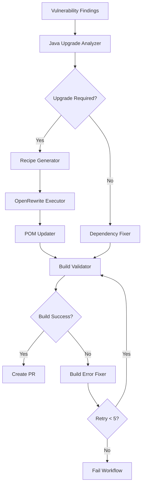
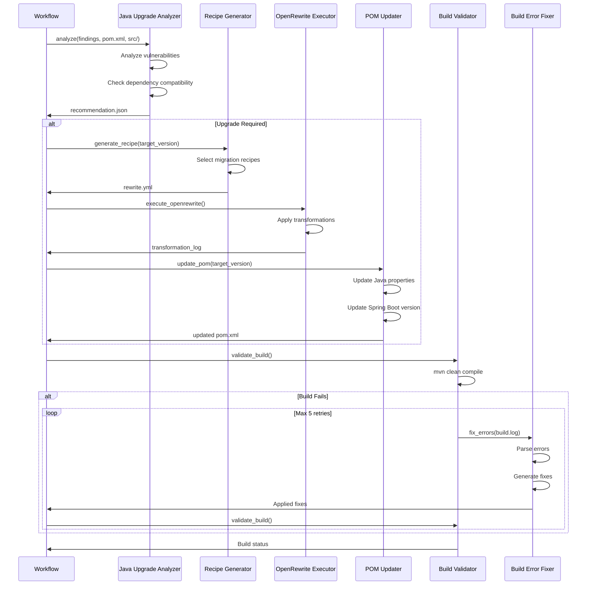

# Design Document: Java Upgrade Enhancement

## Overview

This design specifies the architecture and implementation approach for enhancing the AI-powered security remediation workflow with intelligent Java version upgrade capabilities. The enhancement adds a decision engine that determines when Java upgrades are necessary to fix vulnerabilities, integrates OpenRewrite for automated code migration, and extends the self-healing build loop to handle post-upgrade compilation errors.

### Problem Statement

The current remediation workflow can fix dependency vulnerabilities within the same Java version but cannot handle cases where:
- Vulnerabilities require upgrading to a newer Java version
- Security patches are only available in dependency versions that require Java 11 or 17
- Spring Boot upgrades necessitate Java version changes

### Solution Approach

The solution introduces a **decision-driven workflow** that:
1. **Analyzes** vulnerability findings to determine if Java upgrade is required
2. **Generates** OpenRewrite recipes for automated code migration
3. **Executes** OpenRewrite transformations to migrate code to target Java version
4. **Validates** the build and applies AI-powered fixes for any compilation errors
5. **Integrates** seamlessly into the existing GitHub Actions workflow

### Key Design Principles

- **Intelligent Decision Making**: Use AI to analyze vulnerability patterns and recommend optimal Java version
- **Automated Migration**: Leverage OpenRewrite for consistent, repeatable code transformations
- **Self-Healing**: Extend existing AI-powered error fixing to handle post-migration issues
- **Fail-Safe**: Provide clear rollback paths and diagnostic information when upgrades fail
- **Audit Trail**: Maintain comprehensive logs of all decisions and transformations

## Architecture

### High-Level Architecture



### Component Architecture

The system consists of seven primary components:

1. **Java_Upgrade_Analyzer** - Decision engine for upgrade necessity
2. **Recipe_Generator** - Creates OpenRewrite recipe configurations
3. **OpenRewrite_Executor** - Executes code transformations
4. **POM_Updater** - Updates Maven configuration for target Java version
5. **Build_Validator** - Validates compilation after changes
6. **Build_Error_Fixer** - AI-powered compilation error resolution
7. **Workflow_Orchestrator** - Coordinates component execution in GitHub Actions

### Data Flow



## Components and Interfaces

### 1. Java_Upgrade_Analyzer

**Purpose**: Analyzes vulnerability findings and project configuration to determine if Java version upgrade is required and recommend the optimal target version.

**Implementation**: Python script `.github/scripts/analyze_java_upgrade.py`

**Inputs**:
- `findings_file` (string): Path to normalized vulnerability findings JSON
- `pom_file` (string): Path to pom.xml
- `src_dir` (string): Path to source directory

**Outputs**:
- `java_upgrade_recommendation.json`: JSON file containing:
  ```json
  {
    "recommendation": "STAY_JAVA_8" | "UPGRADE_JAVA_11" | "UPGRADE_JAVA_17",
    "confidence": 0.0-1.0,
    "current_java_version": "1.8",
    "target_java_version": "11" | "17",
    "rationale": "Explanation of decision",
    "vulnerabilities_requiring_upgrade": [
      {
        "cve": "CVE-XXXX-XXXX",
        "package": "package-name",
        "current_version": "1.0.0",
        "fixed_version": "2.0.0",
        "min_java_version": "11",
        "severity": "HIGH"
      }
    ],
    "all_vulnerabilities_addressed": [
      {
        "cve": "CVE-YYYY-YYYY",
        "package": "another-package",
        "current_version": "1.0.0",
        "fixed_version": "1.0.5",
        "min_java_version": "8",
        "severity": "CRITICAL"
      }
    ],
    "spring_boot_upgrade_required": true | false,
    "target_spring_boot_version": "3.0.0",
    "migration_complexity": "LOW" | "MEDIUM" | "HIGH"
  }
  ```

**Field Descriptions**:
- `vulnerabilities_requiring_upgrade`: Vulnerabilities that **force** the Java upgrade (min_java_version > current_java_version)
- `all_vulnerabilities_addressed`: **ALL** vulnerabilities found, including those fixable in the current Java version

**Algorithm**:

```python
def analyze_java_upgrade(findings, pom, src_dir):
    # Step 1: Extract current Java version from pom.xml
    current_java = extract_java_version(pom)
    
    # Step 2: Analyze each vulnerability
    upgrade_required_vulns = []
    for vuln in findings['vulnerabilities']:
        # Check if fix requires higher Java version
        fix_info = get_fix_requirements(vuln)
        if fix_info['min_java_version'] > current_java:
            upgrade_required_vulns.append(vuln)
    
    # Step 3: Determine target Java version
    if not upgrade_required_vulns:
        return {"recommendation": "STAY_JAVA_8"}
    
    # Find minimum Java version that fixes all vulnerabilities
    required_versions = [v['min_java_version'] for v in upgrade_required_vulns]
    target_java = max(required_versions)
    
    # Step 4: Check Spring Boot compatibility
    current_spring_boot = extract_spring_boot_version(pom)
    spring_boot_upgrade = check_spring_boot_compatibility(
        current_spring_boot, target_java
    )
    
    # Step 5: Assess migration complexity
    complexity = assess_migration_complexity(src_dir, current_java, target_java)
    
    # Step 6: Generate recommendation
    return {
        "recommendation": f"UPGRADE_JAVA_{target_java}",
        "confidence": calculate_confidence(upgrade_required_vulns, complexity),
        "current_java_version": current_java,
        "target_java_version": target_java,
        "rationale": generate_rationale(upgrade_required_vulns),
        "vulnerabilities_requiring_upgrade": upgrade_required_vulns,
        "spring_boot_upgrade_required": spring_boot_upgrade['required'],
        "target_spring_boot_version": spring_boot_upgrade['target_version'],
        "migration_complexity": complexity
    }
```

**Decision Logic**:

1. **STAY_JAVA_8**: All vulnerabilities can be fixed with dependency updates in Java 8
2. **UPGRADE_JAVA_11**: One or more vulnerabilities require Java 11+, and Spring Boot 2.7.x is compatible
3. **UPGRADE_JAVA_17**: One or more vulnerabilities require Java 17+, necessitating Spring Boot 3.x upgrade

**AI Integration**:
- Uses GitHub Models API to analyze vulnerability patterns
- Queries Maven Central API to check dependency version requirements
- Analyzes source code for Java 8-specific patterns that may complicate migration

### 2. Recipe_Generator

**Purpose**: Generates OpenRewrite recipe configuration files for Java version migration.

**Implementation**: Python script `.github/scripts/generate_openrewrite_recipe.py`

**Inputs**:
- `recommendation` (dict): Output from Java_Upgrade_Analyzer
- `pom_file` (string): Path to pom.xml

**Outputs**:
- `rewrite.yml`: OpenRewrite recipe configuration file
- Updated `pom.xml` with OpenRewrite plugin configuration

**Recipe Templates**:

**Java 8 → Java 11 Migration**:
```yaml
---
type: specs.openrewrite.org/v1beta/recipe
name: com.example.MigrateToJava11
displayName: Migrate to Java 11
description: Migrates Java 8 code to Java 11
recipeList:
  - org.openrewrite.java.migrate.Java8toJava11
  - org.openrewrite.java.migrate.UpgradeBuildToJava11
  - org.openrewrite.java.migrate.javax.AddJaxbRuntime
  - org.openrewrite.java.migrate.javax.AddJaxwsRuntime
  - org.openrewrite.java.migrate.UpgradePluginsForJava11
```

**Java 8 → Java 17 Migration (with Spring Boot 3)**:
```yaml
---
type: specs.openrewrite.org/v1beta/recipe
name: com.example.MigrateToJava17WithSpringBoot3
displayName: Migrate to Java 17 with Spring Boot 3
description: Migrates Java 8 code to Java 17 and Spring Boot 3
recipeList:
  - org.openrewrite.java.migrate.UpgradeToJava17
  - org.openrewrite.java.spring.boot3.UpgradeSpringBoot_3_0
  - org.openrewrite.java.migrate.jakarta.JavaxMigrationToJakarta
  - org.openrewrite.java.migrate.javax.AddJaxbRuntime
  - org.openrewrite.java.migrate.javax.AddJaxwsRuntime
```

**POM Plugin Configuration**:
```xml
<plugin>
    <groupId>org.openrewrite.maven</groupId>
    <artifactId>rewrite-maven-plugin</artifactId>
    <version>5.42.0</version>
    <configuration>
        <activeRecipes>
            <recipe>com.example.MigrateToJava11</recipe>
        </activeRecipes>
    </configuration>
    <dependencies>
        <dependency>
            <groupId>org.openrewrite.recipe</groupId>
            <artifactId>rewrite-migrate-java</artifactId>
            <version>2.26.1</version>
        </dependency>
        <dependency>
            <groupId>org.openrewrite.recipe</groupId>
            <artifactId>rewrite-spring</artifactId>
            <version>5.21.0</version>
        </dependency>
    </dependencies>
</plugin>
```

**Algorithm**:

```python
def generate_recipe(recommendation, pom_file):
    target_version = recommendation['target_java_version']
    spring_boot_upgrade = recommendation['spring_boot_upgrade_required']
    
    # Select appropriate recipe template
    if target_version == '11':
        recipe = JAVA_11_RECIPE_TEMPLATE
        dependencies = ['rewrite-migrate-java']
    elif target_version == '17':
        recipe = JAVA_17_RECIPE_TEMPLATE
        dependencies = ['rewrite-migrate-java']
        
        if spring_boot_upgrade:
            recipe['recipeList'].extend(SPRING_BOOT_3_RECIPES)
            dependencies.append('rewrite-spring')
    
    # Write rewrite.yml
    write_yaml('rewrite.yml', recipe)
    
    # Update pom.xml with plugin configuration
    add_openrewrite_plugin(pom_file, recipe['name'], dependencies)
    
    return {
        'recipe_file': 'rewrite.yml',
        'recipe_name': recipe['name'],
        'dependencies': dependencies
    }
```

### 3. OpenRewrite_Executor

**Purpose**: Executes OpenRewrite Maven plugin to apply code transformations.

**Implementation**: Bash script in GitHub Actions workflow

**Inputs**:
- `rewrite.yml`: Recipe configuration file
- `pom.xml`: Maven configuration with OpenRewrite plugin

**Outputs**:
- Modified source files in `src/`
- `openrewrite_execution.log`: Execution log

**Execution Command**:
```bash
mvn org.openrewrite.maven:rewrite-maven-plugin:run \
    -Drewrite.activeRecipes=com.example.MigrateToJava11 \
    2>&1 | tee openrewrite_execution.log
```

**Error Handling**:
- Captures Maven exit code
- Parses log for OpenRewrite-specific errors
- Reports number of files modified
- Fails workflow if OpenRewrite execution fails

**Success Criteria**:
- Maven exit code = 0
- Log contains "BUILD SUCCESS"
- At least one file modified (or explicit "no changes needed" message)

### 4. POM_Updater

**Purpose**: Updates pom.xml with target Java version and Spring Boot version.

**Implementation**: Python script `.github/scripts/update_pom_versions.py`

**Inputs**:
- `pom_file` (string): Path to pom.xml
- `target_java_version` (string): Target Java version (11 or 17)
- `target_spring_boot_version` (string): Target Spring Boot version (optional)

**Outputs**:
- Updated `pom.xml`

**Transformations**:

1. **Java Version Properties**:
```xml
<!-- Before -->
<properties>
    <java.version>1.8</java.version>
    <maven.compiler.source>1.8</maven.compiler.source>
    <maven.compiler.target>1.8</maven.compiler.target>
</properties>

<!-- After (Java 11) -->
<properties>
    <java.version>11</java.version>
    <maven.compiler.source>11</maven.compiler.source>
    <maven.compiler.target>11</maven.compiler.target>
</properties>
```

2. **Spring Boot Parent Version** (if upgrading to Java 17):
```xml
<!-- Before -->
<parent>
    <groupId>org.springframework.boot</groupId>
    <artifactId>spring-boot-starter-parent</artifactId>
    <version>2.7.18</version>
</parent>

<!-- After -->
<parent>
    <groupId>org.springframework.boot</groupId>
    <artifactId>spring-boot-starter-parent</artifactId>
    <version>3.0.0</version>
</parent>
```

3. **Spring Framework Dependencies** (if upgrading to Spring Boot 3):
```xml
<!-- Before -->
<dependency>
    <groupId>org.springframework</groupId>
    <artifactId>spring-webmvc</artifactId>
    <version>5.3.31</version>
</dependency>

<!-- After -->
<dependency>
    <groupId>org.springframework</groupId>
    <artifactId>spring-webmvc</artifactId>
    <version>6.0.0</version>
</dependency>
```

**Algorithm**:
```python
def update_pom(pom_file, target_java, target_spring_boot=None):
    tree = parse_xml(pom_file)
    
    # Update Java version properties
    update_property(tree, 'java.version', target_java)
    update_property(tree, 'maven.compiler.source', target_java)
    update_property(tree, 'maven.compiler.target', target_java)
    
    # Update Spring Boot if required
    if target_spring_boot:
        update_parent_version(tree, 'spring-boot-starter-parent', target_spring_boot)
        
        # Update Spring Framework dependencies
        spring_framework_version = get_compatible_spring_version(target_spring_boot)
        update_dependency_versions(tree, 'org.springframework', spring_framework_version)
    
    write_xml(pom_file, tree)
```

### 5. Build_Validator

**Purpose**: Validates that the project compiles successfully after Java upgrade and code transformations.

**Implementation**: Bash script in GitHub Actions workflow

**Inputs**:
- Modified source files
- Updated `pom.xml`

**Outputs**:
- `post_upgrade_build.log`: Compilation log
- Build status (success/failure)
- Error count and error details

**Validation Process**:
```bash
#!/bin/bash

MAX_RETRIES=5
COUNT=1

while [ $COUNT -le $MAX_RETRIES ]; do
    echo "════════════════════════════════════════════"
    echo "🔁 BUILD VALIDATION ITERATION $COUNT"
    echo "════════════════════════════════════════════"
    
    # Compile project
    mvn clean compile 2>&1 | tee post_upgrade_build.log
    
    # Check for success
    if grep -q "BUILD SUCCESS" post_upgrade_build.log; then
        echo "✅ Build succeeded at iteration $COUNT"
        exit 0
    fi
    
    # Count errors
    ERROR_COUNT=$(grep -c "\[ERROR\].*\.java:" post_upgrade_build.log || echo 0)
    echo "❌ Build failed with $ERROR_COUNT errors"
    
    # Invoke Build Error Fixer
    echo "🤖 Running AI Fix Agent..."
    python .github/scripts/fix_build_errors.py post_upgrade_build.log pom.xml src/
    
    COUNT=$((COUNT+1))
done

echo "🚨 Build failed after $MAX_RETRIES attempts"
exit 1
```

**Success Criteria**:
- Maven exit code = 0
- Log contains "BUILD SUCCESS"
- No compilation errors

**Failure Handling**:
- Invokes Build_Error_Fixer
- Retries up to 5 times
- Fails workflow if all retries exhausted

### 6. Build_Error_Fixer

**Purpose**: AI-powered component that analyzes compilation errors and generates fixes.

**Implementation**: Python script `.github/scripts/fix_build_errors.py`

**Inputs**:
- `build_log` (string): Path to compilation log
- `pom_file` (string): Path to pom.xml
- `src_dir` (string): Path to source directory

**Outputs**:
- Modified source files with fixes applied
- `fix_build_errors_report.txt`: Summary of fixes

**Algorithm**:

```python
def fix_build_errors(build_log, pom_file, src_dir):
    # Step 1: Parse build log to extract errors
    errors = parse_compilation_errors(build_log)
    
    # Step 2: Group errors by file
    errors_by_file = group_by_file(errors)
    
    # Step 3: For each file with errors
    fixes_applied = []
    for file_path, file_errors in errors_by_file.items():
        # Read file content
        content = read_file(file_path)
        
        # Prepare AI prompt
        prompt = f"""
        Fix the following compilation errors in this Java file.
        Preserve all business logic and only fix compilation issues.
        
        File: {file_path}
        
        Errors:
        {format_errors(file_errors)}
        
        Current code:
        {content}
        
        Provide the corrected code.
        """
        
        # Call AI to generate fix
        fixed_content = call_github_models_api(prompt)
        
        # Apply fix
        write_file(file_path, fixed_content)
        fixes_applied.append({
            'file': file_path,
            'errors_fixed': len(file_errors)
        })
    
    # Step 4: Generate report
    generate_report('fix_build_errors_report.txt', fixes_applied)
    
    return fixes_applied
```

**Common Error Patterns**:

1. **Missing imports after javax → jakarta migration**:
```java
// Error: package javax.persistence does not exist
// Fix: import jakarta.persistence.*;
```

2. **Deprecated API usage**:
```java
// Error: method setAllowCredentials(Boolean) is deprecated
// Fix: Use setAllowCredentials(boolean) instead
```

3. **Type inference changes**:
```java
// Error: incompatible types: inference variable T has incompatible bounds
// Fix: Add explicit type parameters
```

**AI Prompt Strategy**:
- Provide full file context
- Include exact compiler error messages
- Emphasize preserving business logic
- Request minimal changes to fix errors

### 7. Workflow_Orchestrator

**Purpose**: Coordinates execution of all components within GitHub Actions workflow.

**Implementation**: GitHub Actions YAML workflow (`.github/workflows/Remediation.yml`)

**Workflow Steps**:

```yaml
# Step 1: Analyze Java Upgrade Requirement
- name: Analyze Java Version Upgrade Recommendation
  env:
    GITHUB_TOKEN: ${{ secrets.GITHUB_TOKEN }}
  run: |
    echo "🤖 Running AI analysis to determine optimal Java version..."
    python .github/scripts/analyze_java_upgrade.py snyk.json pom.xml src/
    
    if [ -f "java_upgrade_recommendation.json" ]; then
      echo "✓ Java upgrade analysis complete"
      cat java_upgrade_recommendation.json
      
      # Extract recommendation
      RECOMMENDATION=$(jq -r '.recommendation' java_upgrade_recommendation.json)
      echo "JAVA_UPGRADE_RECOMMENDATION=$RECOMMENDATION" >> $GITHUB_ENV
    else
      echo "⚠ Java upgrade analysis failed, proceeding with current Java version"
      echo "JAVA_UPGRADE_RECOMMENDATION=STAY_JAVA_8" >> $GITHUB_ENV
    fi

# Step 2: Branch based on recommendation
- name: Generate OpenRewrite Recipe
  if: env.JAVA_UPGRADE_RECOMMENDATION != 'STAY_JAVA_8'
  run: |
    echo "🔧 Generating OpenRewrite recipe for Java upgrade..."
    python .github/scripts/generate_openrewrite_recipe.py \
      java_upgrade_recommendation.json pom.xml

# Step 3: Execute OpenRewrite
- name: Execute OpenRewrite Migration
  if: env.JAVA_UPGRADE_RECOMMENDATION != 'STAY_JAVA_8'
  run: |
    echo "🚀 Executing OpenRewrite transformations..."
    mvn org.openrewrite.maven:rewrite-maven-plugin:run \
      2>&1 | tee openrewrite_execution.log
    
    if grep -q "BUILD SUCCESS" openrewrite_execution.log; then
      echo "✅ OpenRewrite execution successful"
    else
      echo "❌ OpenRewrite execution failed"
      exit 1
    fi

# Step 4: Update POM versions
- name: Update POM Versions
  if: env.JAVA_UPGRADE_RECOMMENDATION != 'STAY_JAVA_8'
  run: |
    echo "📝 Updating pom.xml versions..."
    python .github/scripts/update_pom_versions.py \
      java_upgrade_recommendation.json pom.xml

# Step 5: Fix Dependencies (always runs)
- name: Fix Dependencies
  run: |
    python .github/scripts/fix_dependencies.py snyk.json pom.xml

# Step 6: Self-Healing Build Loop
- name: Self-Healing Build (AI Loop)
  env:
    GITHUB_TOKEN: ${{ secrets.GITHUB_TOKEN }}
  run: |
    MAX_RETRIES=5
    COUNT=1
    
    while [ $COUNT -le $MAX_RETRIES ]; do
      echo "════════════════════════════════════════════"
      echo "🔁 ITERATION $COUNT"
      echo "════════════════════════════════════════════"
      
      mvn clean compile 2>&1 | tee build.log || true
      
      if grep -q "BUILD SUCCESS" build.log; then
        echo "✅ Build succeeded at iteration $COUNT"
        exit 0
      fi
      
      ERROR_COUNT=$(grep -c "\[ERROR\].*\.java:" build.log || echo 0)
      echo "❌ Build failed with $ERROR_COUNT errors"
      
      echo "🤖 Running AI Fix Agent..."
      python .github/scripts/fix_build_errors.py build.log pom.xml src/
      
      COUNT=$((COUNT+1))
    done
    
    echo "🚨 Build failed after $MAX_RETRIES attempts"
    exit 1

# Step 7: Upload artifacts
- name: Upload Logs and Reports
  if: always()
  uses: actions/upload-artifact@v4
  with:
    name: java-upgrade-logs
    path: |
      java_upgrade_recommendation.json
      openrewrite_execution.log
      post_upgrade_build.log
      fix_build_errors_report.txt
      build.log
```

**Decision Flow**:
```
Vulnerability Findings
    ↓
Java_Upgrade_Analyzer
    ↓
    ├─→ STAY_JAVA_8 → Dependency_Fixer → Build_Validator
    ├─→ UPGRADE_JAVA_11 → Recipe_Generator → OpenRewrite_Executor → POM_Updater → Dependency_Fixer → Build_Validator
    └─→ UPGRADE_JAVA_17 → Recipe_Generator → OpenRewrite_Executor → POM_Updater → Dependency_Fixer → Build_Validator
```

## Data Models

### Vulnerability Finding

```json
{
  "cve": "CVE-2024-XXXX",
  "package": "org.springframework:spring-webmvc",
  "current_version": "5.3.31",
  "fixed_version": "6.0.0",
  "severity": "HIGH",
  "description": "Security vulnerability description",
  "cvss_score": 7.5,
  "min_java_version": "17"
}
```

### Java Upgrade Recommendation

```json
{
  "recommendation": "UPGRADE_JAVA_17",
  "confidence": 0.95,
  "current_java_version": "1.8",
  "target_java_version": "17",
  "rationale": "3 high-severity vulnerabilities require Java 17+",
  "vulnerabilities_requiring_upgrade": [
    {
      "cve": "CVE-2024-XXXX",
      "package": "org.springframework:spring-webmvc",
      "current_version": "5.3.31",
      "fixed_version": "6.0.0",
      "min_java_version": "17"
    }
  ],
  "spring_boot_upgrade_required": true,
  "target_spring_boot_version": "3.0.0",
  "migration_complexity": "MEDIUM",
  "estimated_files_affected": 45,
  "breaking_changes": [
    "javax to jakarta namespace migration",
    "Spring Security API changes",
    "Deprecated method removals"
  ]
}
```

### OpenRewrite Execution Result

```json
{
  "status": "SUCCESS",
  "files_modified": 23,
  "files_analyzed": 45,
  "recipes_applied": [
    "org.openrewrite.java.migrate.UpgradeToJava17",
    "org.openrewrite.java.spring.boot3.UpgradeSpringBoot_3_0",
    "org.openrewrite.java.migrate.jakarta.JavaxMigrationToJakarta"
  ],
  "execution_time_seconds": 45,
  "changes_by_type": {
    "import_changes": 67,
    "api_migrations": 12,
    "deprecation_fixes": 8
  }
}
```

### Build Error

```json
{
  "file": "src/main/java/com/example/UserController.java",
  "line": 23,
  "column": 15,
  "error_type": "COMPILATION_ERROR",
  "message": "package javax.persistence does not exist",
  "severity": "ERROR"
}
```

### Fix Report

```json
{
  "timestamp": "2024-01-15T10:30:00Z",
  "files_fixed": 8,
  "errors_fixed": 15,
  "fixes_by_type": {
    "import_fixes": 10,
    "api_migrations": 3,
    "type_fixes": 2
  },
  "files": [
    {
      "path": "src/main/java/com/example/UserController.java",
      "errors_fixed": 3,
      "changes": [
        "Replaced javax.persistence imports with jakarta.persistence",
        "Updated @Entity annotation usage",
        "Fixed deprecated method calls"
      ]
    }
  ]
}
```


## Correctness Properties

*A property is a characteristic or behavior that should hold true across all valid executions of a system—essentially, a formal statement about what the system should do. Properties serve as the bridge between human-readable specifications and machine-verifiable correctness guarantees.*

### Property 1: Recommendation Validity

*For any* valid vulnerability findings and project configuration, the Java_Upgrade_Analyzer SHALL return a recommendation that is exactly one of "STAY_JAVA_8", "UPGRADE_JAVA_11", or "UPGRADE_JAVA_17".

**Validates: Requirements 1.3**

### Property 2: Recommendation File Creation

*For any* execution of the Java_Upgrade_Analyzer, a file named "java_upgrade_recommendation.json" SHALL be created containing the recommendation and rationale.

**Validates: Requirements 1.7**

### Property 3: Recommendation Completeness

*For any* Java upgrade recommendation, the output SHALL include vulnerability count, severity levels, migration complexity, and decision rationale.

**Validates: Requirements 1.6**

### Property 4: Workflow Branching Consistency

*For any* recommendation value, the Remediation_Workflow SHALL execute the OpenRewrite upgrade path if and only if the recommendation is "UPGRADE_JAVA_11" or "UPGRADE_JAVA_17", otherwise it SHALL execute the dependency-only fix path.

**Validates: Requirements 1.4, 1.5, 6.2, 6.3, 6.4**

### Property 5: Recipe Selection Correctness

*For any* Java upgrade requirement, the Recipe_Generator SHALL include recipes appropriate to the target version: "Java8toJava11" recipes for Java 11 targets, "UpgradeToJava17" and "JavaxMigrationToJakarta" recipes for Java 17 targets, and Spring Boot 3 upgrade recipes when Spring Boot upgrade is required.

**Validates: Requirements 2.2, 2.3, 2.4, 2.5, 9.3, 9.6**

### Property 6: Recipe File Validity

*For any* generated OpenRewrite recipe, the recipe file SHALL be syntactically valid YAML that can be parsed without errors.

**Validates: Requirements 2.7**

### Property 7: POM Consistency After Upgrade

*For any* Java version upgrade, the updated pom.xml SHALL have java.version, maven.compiler.source, and maven.compiler.target properties all set to the same target version, and if Spring Boot is upgraded, all Spring Boot starter dependencies and Spring Framework dependencies SHALL have versions compatible with the target Spring Boot version.

**Validates: Requirements 3.3, 3.4, 3.5, 9.2, 9.4, 9.5**

### Property 8: Build Error Extraction and Grouping

*For any* build log containing compilation errors, the Build_Error_Fixer SHALL extract all error messages and group them by file path such that each file appears exactly once in the grouping with all its associated errors.

**Validates: Requirements 5.1, 5.2**

### Property 9: AI Fix Invocation Completeness

*For any* set of files with compilation errors, the Build_Error_Fixer SHALL invoke AI to generate fixes for each file exactly once, providing both the file content and the exact compiler error messages.

**Validates: Requirements 5.3, 5.4**

### Property 10: Output File Naming Consistency

*For any* component execution, output files SHALL be created with their specified names: "java_upgrade_recommendation.json" for analyzer output, "rewrite.yml" for recipe files, "openrewrite_execution.log" for OpenRewrite execution, "post_upgrade_build.log" for build validation, and "fix_build_errors_report.txt" for error fix reports.

**Validates: Requirements 1.7, 2.6, 3.6, 4.2, 5.7**

### Property 11: OpenRewrite Plugin Configuration Preservation

*For any* pom.xml with existing OpenRewrite plugin configuration, the Recipe_Generator SHALL preserve all existing configuration elements and only add missing required elements.

**Validates: Requirements 8.7**

### Property 12: Plugin Dependency Completeness

*For any* OpenRewrite plugin configuration, the Recipe_Generator SHALL include the rewrite-migrate-java dependency, and SHALL additionally include rewrite-migrate-jakarta dependency if and only if Jakarta migration is required.

**Validates: Requirements 8.3, 8.4**

### Property 13: Spring Boot Compatibility Enforcement

*For any* Java 17 upgrade, the Recipe_Generator SHALL upgrade Spring Boot to version 3.x and update Spring Framework dependencies to version 6.x, and for any Java 11 upgrade with Spring Boot 2.7.x, SHALL verify compatibility without upgrading Spring Boot.

**Validates: Requirements 9.1, 9.2, 9.5**

### Property 14: Summary Report Completeness

*For any* workflow execution, the generated summary report SHALL include the Java upgrade recommendation, confidence level, number of vulnerabilities fixed, number of files modified by OpenRewrite (if applicable), number of build errors fixed by AI (if applicable), final build status, and links to all log files and artifacts.

**Validates: Requirements 10.2, 10.3, 10.4, 10.5, 10.6, 10.10**

### Property 15: Artifact Preservation

*For any* workflow execution, all log files (java_upgrade_recommendation.json, openrewrite_execution.log, post_upgrade_build.log, fix_build_errors_report.txt, build.log) SHALL be uploaded as workflow artifacts.

**Validates: Requirements 7.4, 10.9**

### Property 16: Failure Prevents Push

*For any* workflow execution where any step fails, no changes SHALL be pushed to the remote repository.

**Validates: Requirements 7.6**

### Property 17: Build Retry Limit

*For any* build validation with persistent failures, the Build_Validator SHALL retry compilation exactly 5 times before halting the workflow.

**Validates: Requirements 4.5, 4.6**

## Error Handling

### Error Categories

The system handles four categories of errors:

1. **Analysis Errors**: Failures in Java_Upgrade_Analyzer
2. **Migration Errors**: Failures in OpenRewrite execution
3. **Build Errors**: Compilation failures after transformations
4. **Integration Errors**: Failures in external tool invocations

### Error Handling Strategy

#### Analysis Errors

**Scenario**: Java_Upgrade_Analyzer fails to analyze vulnerability findings

**Handling**:
- Log error with full stack trace
- Set recommendation to "STAY_JAVA_8" (safe fallback)
- Continue workflow with dependency-only fixes
- Include warning in workflow summary

**Rationale**: Analysis failure should not block remediation entirely. Falling back to dependency-only fixes provides value even without Java upgrade analysis.

#### Migration Errors

**Scenario**: OpenRewrite execution fails

**Handling**:
- Log error with OpenRewrite output
- Halt workflow immediately
- Do not create pull request
- Upload all logs as artifacts
- Provide actionable error message

**Rationale**: Migration failures indicate fundamental incompatibility. Continuing would likely result in broken code. Manual intervention is required.

#### Build Errors

**Scenario**: Compilation fails after code transformations

**Handling**:
- Parse build log to extract errors
- Invoke Build_Error_Fixer with AI
- Retry compilation
- Repeat up to 5 times
- If all retries fail, halt workflow
- Upload all logs and partial fixes as artifacts

**Rationale**: Many post-migration build errors are mechanical (imports, deprecated APIs) and can be fixed automatically. The retry loop provides resilience while preventing infinite loops.

#### Integration Errors

**Scenario**: External tool (Maven, Git) fails

**Handling**:
- Log error with tool output
- Halt workflow immediately
- Provide diagnostic information
- Upload logs as artifacts

**Rationale**: Integration failures indicate environment issues. Continuing would likely cascade into more failures.

### Rollback Mechanisms

#### Automatic Rollback

The workflow uses Git branching to provide automatic rollback:
- All changes are made on a feature branch
- Changes are only pushed if all steps succeed
- Failed workflows leave main branch untouched
- Users can delete failed branches

#### Manual Rollback

If a pull request is merged but causes issues:
1. Revert the pull request commit
2. Re-run workflow with updated configuration
3. Review logs from failed attempt to identify root cause

### Diagnostic Logging

Each component produces structured logs:

**Java_Upgrade_Analyzer**:
```json
{
  "timestamp": "2024-01-15T10:30:00Z",
  "component": "Java_Upgrade_Analyzer",
  "status": "SUCCESS",
  "recommendation": "UPGRADE_JAVA_17",
  "confidence": 0.95,
  "vulnerabilities_analyzed": 15,
  "vulnerabilities_requiring_upgrade": 3,
  "execution_time_ms": 2500
}
```

**OpenRewrite_Executor**:
```json
{
  "timestamp": "2024-01-15T10:32:00Z",
  "component": "OpenRewrite_Executor",
  "status": "SUCCESS",
  "files_modified": 23,
  "recipes_applied": [
    "org.openrewrite.java.migrate.UpgradeToJava17",
    "org.openrewrite.java.spring.boot3.UpgradeSpringBoot_3_0"
  ],
  "execution_time_ms": 45000
}
```

**Build_Error_Fixer**:
```json
{
  "timestamp": "2024-01-15T10:35:00Z",
  "component": "Build_Error_Fixer",
  "iteration": 1,
  "status": "SUCCESS",
  "files_fixed": 8,
  "errors_fixed": 15,
  "ai_invocations": 8,
  "execution_time_ms": 12000
}
```

### Error Message Guidelines

All error messages follow this template:

```
❌ [COMPONENT] [ERROR_TYPE]

Description: [What went wrong]
Impact: [What this means for the workflow]
Action: [What the user should do]

Logs: [Links to relevant log files]
Documentation: [Links to relevant docs]
```

Example:
```
❌ OpenRewrite_Executor MIGRATION_FAILED

Description: OpenRewrite failed to apply Java 17 migration recipes
Impact: Java upgrade cannot proceed automatically
Action: Review openrewrite_execution.log for specific errors. Common issues:
  - Incompatible dependency versions
  - Custom code patterns not recognized by OpenRewrite
  - Missing plugin dependencies

Logs: openrewrite_execution.log (uploaded as artifact)
Documentation: https://docs.openrewrite.org/running-recipes/getting-started
```

## Testing Strategy

### Testing Approach

The Java Upgrade Enhancement feature requires a **dual testing approach**:

1. **Property-Based Tests**: Verify universal properties across all valid inputs
2. **Integration Tests**: Verify component interactions and external tool integrations
3. **Example-Based Unit Tests**: Verify specific scenarios and edge cases

### Property-Based Testing

**Framework**: fast-check (JavaScript/TypeScript) or Hypothesis (Python)

**Configuration**: Minimum 100 iterations per property test

**Test Structure**:
```python
# Feature: java-upgrade-enhancement, Property 1: Recommendation Validity
@given(vulnerability_findings=st.vulnerability_findings(),
       pom_config=st.pom_configurations())
def test_recommendation_validity(vulnerability_findings, pom_config):
    """For any valid vulnerability findings and project configuration,
    the analyzer returns one of three valid recommendations."""
    
    recommendation = analyze_java_upgrade(vulnerability_findings, pom_config)
    
    assert recommendation['recommendation'] in [
        'STAY_JAVA_8',
        'UPGRADE_JAVA_11',
        'UPGRADE_JAVA_17'
    ]
```

**Generators**:

```python
# Vulnerability findings generator
@st.composite
def vulnerability_findings(draw):
    num_vulns = draw(st.integers(min_value=0, max_value=50))
    return {
        'vulnerabilities': [
            {
                'cve': draw(st.text(min_size=10, max_size=20)),
                'package': draw(st.text(min_size=5, max_size=50)),
                'current_version': draw(st.version_strings()),
                'fixed_version': draw(st.version_strings()),
                'severity': draw(st.sampled_from(['LOW', 'MEDIUM', 'HIGH', 'CRITICAL'])),
                'min_java_version': draw(st.sampled_from(['8', '11', '17']))
            }
            for _ in range(num_vulns)
        ]
    }

# POM configuration generator
@st.composite
def pom_configurations(draw):
    return {
        'java_version': draw(st.sampled_from(['1.8', '11', '17'])),
        'spring_boot_version': draw(st.sampled_from(['2.7.18', '3.0.0', '3.1.0'])),
        'has_openrewrite_plugin': draw(st.booleans())
    }

# Recipe configuration generator
@st.composite
def recipe_configurations(draw):
    target_version = draw(st.sampled_from(['11', '17']))
    spring_boot_upgrade = draw(st.booleans())
    return {
        'target_java_version': target_version,
        'spring_boot_upgrade_required': spring_boot_upgrade,
        'target_spring_boot_version': '3.0.0' if spring_boot_upgrade else None
    }
```

**Property Test Coverage**:

- Property 1: Recommendation Validity (100+ random vulnerability/config combinations)
- Property 4: Workflow Branching Consistency (100+ recommendation scenarios)
- Property 5: Recipe Selection Correctness (100+ upgrade requirement combinations)
- Property 6: Recipe File Validity (100+ generated recipes)
- Property 7: POM Consistency After Upgrade (100+ upgrade scenarios)
- Property 8: Build Error Extraction and Grouping (100+ build log variations)
- Property 10: Output File Naming Consistency (100+ component executions)
- Property 11: OpenRewrite Plugin Configuration Preservation (100+ POM variations)
- Property 12: Plugin Dependency Completeness (100+ configuration scenarios)
- Property 13: Spring Boot Compatibility Enforcement (100+ upgrade combinations)
- Property 14: Summary Report Completeness (100+ workflow executions)

### Integration Testing

**Framework**: pytest with Docker containers for Maven/Git

**Test Scenarios**:

1. **End-to-End Java 11 Upgrade**:
   - Start with Java 8 project with vulnerabilities
   - Run full workflow
   - Verify Java 11 upgrade applied
   - Verify project compiles
   - Verify PR created

2. **End-to-End Java 17 Upgrade with Spring Boot 3**:
   - Start with Java 8 Spring Boot 2.7 project
   - Run full workflow
   - Verify Java 17 and Spring Boot 3 upgrade applied
   - Verify javax → jakarta migration applied
   - Verify project compiles
   - Verify PR created

3. **Fallback to Dependency-Only Fixes**:
   - Start with vulnerabilities fixable in Java 8
   - Run workflow
   - Verify no Java upgrade performed
   - Verify dependencies updated
   - Verify project compiles

4. **Build Error Self-Healing**:
   - Introduce compilation errors after migration
   - Run workflow
   - Verify Build_Error_Fixer invoked
   - Verify errors fixed within 5 retries
   - Verify project compiles

5. **OpenRewrite Failure Handling**:
   - Simulate OpenRewrite failure
   - Run workflow
   - Verify workflow halts
   - Verify no PR created
   - Verify logs uploaded

### Example-Based Unit Tests

**Test Scenarios**:

1. **Specific Recipe Inclusion**:
   - Test Java 11 recipe includes "Java8toJava11"
   - Test Java 17 recipe includes "UpgradeToJava17"
   - Test Spring Boot 3 recipe includes "UpgradeSpringBoot_3_0"

2. **Specific POM Transformations**:
   - Test java.version updated from 1.8 to 11
   - Test Spring Boot parent updated from 2.7.18 to 3.0.0
   - Test Spring Framework updated from 5.3.x to 6.0.x

3. **Specific Error Patterns**:
   - Test javax.persistence import error fixed to jakarta.persistence
   - Test deprecated API usage fixed
   - Test type inference error fixed

4. **Retry Limit**:
   - Test exactly 5 build retries occur
   - Test workflow halts after 5 failures

5. **Error Message Format**:
   - Test error messages follow template
   - Test error messages include actionable guidance

### Test Data

**Sample Vulnerability Findings**:
```json
{
  "vulnerabilities": [
    {
      "cve": "CVE-2024-1234",
      "package": "org.springframework:spring-webmvc",
      "current_version": "5.3.31",
      "fixed_version": "6.0.0",
      "severity": "HIGH",
      "min_java_version": "17"
    },
    {
      "cve": "CVE-2024-5678",
      "package": "org.springframework.boot:spring-boot-starter-web",
      "current_version": "2.7.18",
      "fixed_version": "3.0.0",
      "severity": "MEDIUM",
      "min_java_version": "17"
    }
  ]
}
```

**Sample POM (Java 8)**:
```xml
<?xml version="1.0" encoding="UTF-8"?>
<project>
    <parent>
        <groupId>org.springframework.boot</groupId>
        <artifactId>spring-boot-starter-parent</artifactId>
        <version>2.7.18</version>
    </parent>
    <properties>
        <java.version>1.8</java.version>
        <maven.compiler.source>1.8</maven.compiler.source>
        <maven.compiler.target>1.8</maven.compiler.target>
    </properties>
</project>
```

**Sample Build Log with Errors**:
```
[ERROR] /src/main/java/com/example/UserController.java:[15,8] package javax.persistence does not exist
[ERROR] /src/main/java/com/example/UserController.java:[23,5] cannot find symbol
  symbol:   class Entity
  location: class com.example.UserController
[ERROR] /src/main/java/com/example/UserService.java:[10,8] package javax.persistence does not exist
```

### Continuous Integration

**CI Pipeline**:
1. Run property-based tests (100 iterations each)
2. Run integration tests
3. Run example-based unit tests
4. Generate coverage report (target: 80%+ coverage)
5. Run mutation testing on critical paths

**Test Execution Time**:
- Property-based tests: ~10 minutes
- Integration tests: ~15 minutes
- Unit tests: ~2 minutes
- Total: ~27 minutes

### Test Maintenance

**Property Test Maintenance**:
- Review generators quarterly to ensure realistic data
- Add new generators for new data types
- Adjust iteration counts based on failure patterns

**Integration Test Maintenance**:
- Update test projects when new Java/Spring Boot versions released
- Add new scenarios for new error patterns discovered in production
- Keep Docker images up to date

**Unit Test Maintenance**:
- Add tests for new error patterns
- Update tests when OpenRewrite recipes change
- Remove obsolete tests for deprecated features

## Implementation Notes

### Technology Stack

- **Python 3.9+**: For AI integration and script components
- **GitHub Actions**: For workflow orchestration
- **Maven 3.6+**: For Java project builds
- **OpenRewrite 5.42.0+**: For code transformations
- **GitHub Models API**: For AI-powered analysis and fixes

### Dependencies

**Python Dependencies** (requirements.txt):
```
requests>=2.31.0
pyyaml>=6.0
lxml>=4.9.0
openai>=1.0.0  # For GitHub Models API
```

**Maven Dependencies** (added to pom.xml):
```xml
<plugin>
    <groupId>org.openrewrite.maven</groupId>
    <artifactId>rewrite-maven-plugin</artifactId>
    <version>5.42.0</version>
</plugin>
```

### File Structure

```
.github/
├── workflows/
│   └── Remediation.yml          # Main workflow (updated)
└── scripts/
    ├── analyze_java_upgrade.py  # New: Java upgrade analyzer
    ├── generate_openrewrite_recipe.py  # New: Recipe generator
    ├── update_pom_versions.py   # New: POM updater
    ├── fix_build_errors.py      # New: Build error fixer
    ├── fix_dependencies.py      # Existing: Dependency fixer
    └── fix_imports.py           # Existing: Import fixer
```

### Configuration

**GitHub Secrets Required**:
- `GITHUB_TOKEN`: For GitHub Models API access (automatically provided)
- `JIRA_EMAIL`: For Jira integration (existing)
- `JIRA_API_TOKEN`: For Jira integration (existing)
- `JIRA_URL`: For Jira integration (existing)

**Environment Variables**:
- `JAVA_UPGRADE_RECOMMENDATION`: Set by workflow to pass recommendation between steps
- `BRANCH`: Feature branch name for changes

### Performance Considerations

**Expected Execution Times**:
- Java_Upgrade_Analyzer: 2-5 seconds
- Recipe_Generator: 1-2 seconds
- OpenRewrite_Executor: 30-60 seconds (depends on project size)
- POM_Updater: 1-2 seconds
- Build_Validator: 20-40 seconds per iteration
- Build_Error_Fixer: 10-30 seconds per file

**Total Workflow Time**:
- No upgrade: 2-3 minutes
- Java 11 upgrade: 4-6 minutes
- Java 17 upgrade with Spring Boot 3: 6-10 minutes
- With build error fixing (5 iterations): +5-15 minutes

**Optimization Strategies**:
- Cache Maven dependencies between workflow runs
- Parallelize independent operations where possible
- Use incremental compilation for faster builds
- Limit AI context size to reduce API latency

### Security Considerations

**Code Injection Prevention**:
- Validate all file paths before reading/writing
- Sanitize user inputs in workflow dispatch
- Use parameterized commands instead of string interpolation

**Secrets Management**:
- Never log GitHub tokens or API keys
- Use GitHub Secrets for sensitive configuration
- Rotate tokens regularly

**Supply Chain Security**:
- Pin OpenRewrite plugin version
- Verify Maven Central signatures
- Use dependabot for dependency updates

### Monitoring and Observability

**Metrics to Track**:
- Workflow success rate
- Average execution time
- Java upgrade recommendation distribution
- Build error fix success rate
- Number of retries per workflow

**Logging Strategy**:
- Structured JSON logs for machine parsing
- Human-readable console output for debugging
- Comprehensive error messages with context
- Artifact preservation for post-mortem analysis

### Future Enhancements

**Potential Improvements**:
1. Support for Gradle projects (currently Maven-only)
2. Parallel processing of multiple vulnerability fixes
3. Machine learning model for upgrade recommendation (replace rule-based logic)
4. Automated rollback on PR merge failures
5. Integration with additional security scanners (Checkmarx, Fortify)
6. Support for Java 21 upgrades
7. Custom OpenRewrite recipe generation for project-specific patterns
8. Performance profiling to identify slow transformations
9. Dry-run mode for preview without making changes
10. Interactive mode for user approval of risky changes

